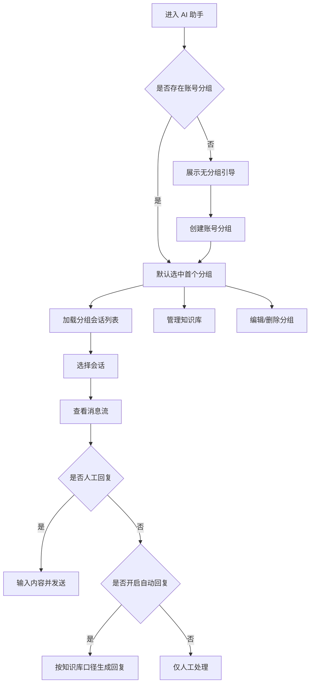
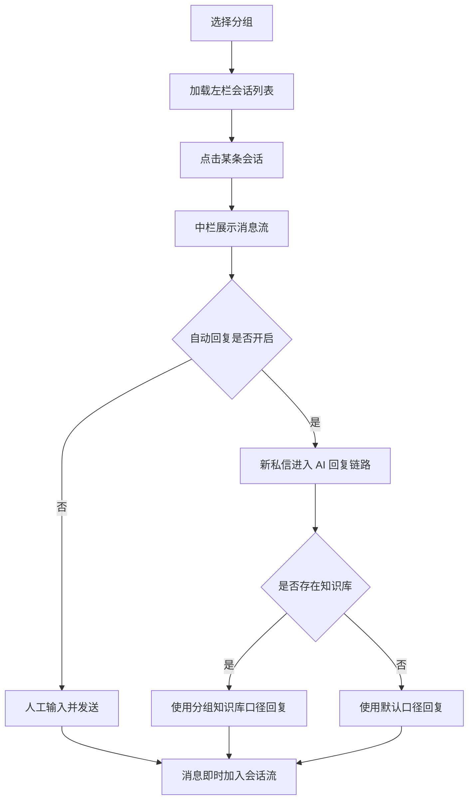
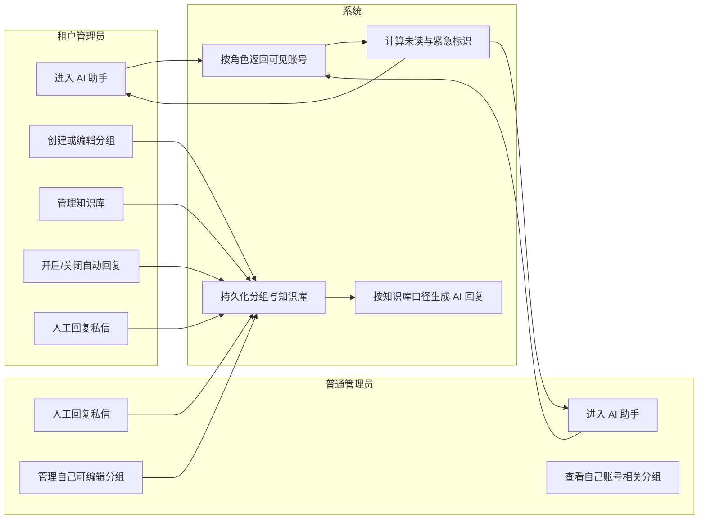

# OrbitHub AI 助手详细版 PRD

## 1. 需求概述

### 1.1 文档信息

| 项目 | 内容 |
|---|---|
| 产品名称 | OrbitHub |
| 模块名称 | AI 助手 |
| 文档类型 | 详细版 PRD |
| 当前版本 | V1.0 |
| 基础输入文档 | `doc/orbithub-ai-assistant-prd.md` |

### 1.2 模块定位

AI 助手是 OrbitHub 中面向私信运营场景的集中处理工作台。模块不再承担“功能导航首页”的角色，而是直接承接运营管理员在多账号矩阵场景下的私信收件、会话处理、AI 自动回复、知识库维护与账号分组管理。

### 1.3 使用场景

- 租户管理员需要按业务线管理多个社交账号的私信
- 普通管理员需要集中处理自己已导入账号的私信会话
- 团队需要将 FAQ、商品卖点、售后规则沉淀为知识库，统一 AI 回复口径
- 运营评审需要在一个页面中直接看到分组、未读、紧急、知识库、人工回复与自动回复能力

### 1.4 进入路径

| 入口页面 | 入口控件 | 跳转路径 | 跳转条件 |
|---|---|---|---|
| 主导航 | `AI 助手` 菜单 | `/ai-assistant` | 当前用户角色为租户管理员或普通管理员 |

### 1.5 需求目标

- 将 AI 助手固定为“分组私信工作台”
- 支持按管理员可见账号建立分组并长期维护
- 支持按分组查看和处理私信会话
- 支持按分组开启或关闭 AI 自动回复
- 支持按分组维护知识库文件
- 支持常亮展示未读和紧急标识，强化运营优先级判断

### 1.6 本期范围

本期范围包含：

- 顶部分组栏
- 无分组引导
- 未分组账号视图
- 左栏会话列表
- 中栏聊天处理区
- 右栏知识库与账号列表
- 创建分组、编辑分组、删除分组
- 管理知识库（上传、列表、删除）
- AI 自动回复开关

本期不包含：

- 实时 WebSocket 推送
- 知识库全文预览与下载
- 跨管理员共享分组
- 人工转人工、标签体系、快捷回复模板
- 已读清零/手动标记已处理动作

## 2. 名词解释

| 名词 | 解释 |
|---|---|
| 账号分组 | 管理员将自己可见的社交账号按业务线归类后的一级组织单元 |
| 未分组账号 | 尚未加入任何账号分组的可见账号集合视图 |
| 私信会话 | 某个客户与某个社交账号之间的消息集合 |
| 紧急标识 | 同一会话最近连续 3 条消息均来自客户时触发的优先级标识 |
| 未读标识 | 当前会话或分组下累计未处理消息数的展示标识 |
| AI 自动回复 | 针对当前分组启用的自动回复开关，决定新私信是否可由 AI 按知识库口径自动回复 |
| 知识库 | 绑定在分组上的文件集合，用于提供 AI 回复口径 |

## 3. 流程图

### 3.1 模块总流程图



### 3.2 分组私信处理流程图



### 3.3 跨职能泳道图



## 4. 角色说明

### 4.1 角色列表

| 角色 | 可访问 | 数据范围 | 核心操作 |
|---|---|---|---|
| 租户管理员 | 是 | 当前租户下可管理账号 | 创建分组、编辑分组、删除分组、管理知识库、切换自动回复、人工回复 |
| 普通管理员 | 是 | 自己导入账号相关数据 | 查看分组、人工回复、管理自己可编辑分组、管理知识库、删除自己可编辑分组 |
| 超级管理员 | 否 | 不在本模块范围 | 不适用，原因：本模块当前不向超级管理员开放；访问 `/ai-assistant` 时返回 403 并跳转到首页 |

### 4.2 权限说明

| 权限维度 | 租户管理员 | 普通管理员 |
|---|---|---|
| 菜单可见 | 可见 | 可见 |
| 分组查看 | 可查看当前租户可管理账号相关分组 | 仅查看自己导入账号所属分组，以及自己创建的未被隐藏分组 |
| 创建分组 | 可用 | 可用 |
| 编辑分组 | 可编辑当前自己视角下分组 | 仅可编辑自己创建或被标记为“可编辑”的分组 |
| 删除分组 | 可用 | 仅可删除自己创建或被标记为“可编辑”的分组 |
| 管理知识库 | 可用 | 可用 |
| 自动回复开关 | 可切换 | 可切换 |
| 越权访问处理 | 返回当前角色可见数据，不返回他人数据 | 返回当前角色可见数据，不返回他人数据 |

### 4.3 权限补充规则

| 场景 | 规则 |
|---|---|
| 普通管理员看到的分组范围 | 仅展示其本人导入账号所属的分组，以及其本人创建的未被隐藏分组 |
| 普通管理员编辑/删除按钮可见性 | 仅在当前分组 `editable=true` 且（该分组由本人创建或本人被授予编辑权限）时显示 `编辑分组` / `删除分组` |
| Token 失效 | 保存当前 URL、当前分组 ID、当前会话 ID 到会话缓存，跳转 `/login`；登录成功后回跳原 URL 并恢复上下文 |

## 5. 功能清单

| 版本 | 模块 | 功能点 | 描述 | 优先级 |
|---|---|---|---|---|
| V1.0 | AI 助手 | 菜单入口 | 点击菜单进入分组私信工作台 | P0 |
| V1.0 | AI 助手 | 无分组引导 | 无分组时展示创建引导 | P0 |
| V1.0 | AI 助手 | 分组栏 | 展示分组名称、账号数、未读、紧急 | P0 |
| V1.0 | AI 助手 | 未分组账号视图 | 展示未归组账号集合 | P1 |
| V1.0 | AI 助手 | 会话列表 | 展示会话摘要、未读、紧急、搜索 | P0 |
| V1.0 | AI 助手 | 聊天处理区 | 展示消息流、人工回复、自动回复开关 | P0 |
| V1.0 | AI 助手 | 知识库 | 上传、列表、删除 | P0 |
| V1.0 | AI 助手 | 账号列表 | 展示当前分组账号，并承载分组管理入口 | P0 |
| V1.0 | AI 助手 | 分组管理 | 创建、编辑、删除分组 | P0 |

### 5.1 页面控件统计汇总

| 页面/弹窗 | 控件总数 | 主要控件类型 |
|---|---:|---|
| AI 助手首页工作台 | 23 | 按钮、搜索框、分组卡、会话卡、开关、输入框、标签、空状态 |
| 创建/编辑账号分组弹窗 | 8 | 输入框、复选框、多选列表、按钮 |
| 管理知识库弹窗 | 8 | 上传入口、文件列表、删除按钮、关闭按钮 |
| 删除分组确认框 | 3 | 标题、确认按钮、取消按钮 |

## 6. 详情功能设计

### 6.1 AI 助手首页工作台

#### 6.1.1 功能概述

AI 助手首页工作台是本模块唯一主页面，用于承接账号分组切换、私信查看、人工回复、自动回复控制与知识库管理。

#### 6.1.2 前置条件

- 当前用户角色为租户管理员或普通管理员
- 用户已成功登录 OrbitHub
- 系统已获取当前用户可见的社交账号数据

#### 6.1.3 后置条件

- 用户可在当前页面完成分组切换与私信处理
- 分组、知识库、自动回复状态等操作结果持久化
- 页面刷新后仍能恢复当前工作台数据状态

#### 6.1.4 页面 ASCII 线框图

```text
+--------------------------------------------------------------------------------------------------+
| 分组私信工作台                                           [创建账号分组]                           |
| 先按账号建立业务分组，再在同一工作台内集中处理私信与知识库。                                     |
|--------------------------------------------------------------------------------------------------|
| [抖音门店咨询  已归组2个  紧急  未读3] [活动咨询跟进 已归组1个 未读2] [未分组账号 待整理]        |
|--------------------------------------------------------------------------------------------------|
| 收到的私信                   | 当前会话                                                         | 右栏 |
| [搜索昵称、消息或账号]       | Naomi WU                                                        | 知识库 |
| [Naomi WU ... 紧急 未读2]   | 客户                                                            | 文件列表 |
| [Alice L ... 未读1]         | 气泡消息流                                                      | 管理知识库 |
| [Mia Zhou ...]              | AI 自动回复 / 人工发送 标识                                     |---------|
|                              | [输入回复内容] [发送回复]                                        | 账号列表 |
|                              |                                                                 | [可编辑分组时显示：编辑分组][删除分组] |
+--------------------------------------------------------------------------------------------------+
```

#### 6.1.5 页面与跳转关系

| 页面 | 入口 | 返回路径 | 页面内跳转 | 外部跳转 |
|---|---|---|---|---|
| AI 助手首页工作台 | 左侧导航 `AI 助手` | 通过全局导航返回其他模块 | 分组切换、会话切换、弹窗打开 | 无 |

#### 6.1.6 控件清单表

| 序号 | 控件名 | 控件类型 | 所属区域 | 说明 |
|---:|---|---|---|---|
| 1 | 工作台标题 | 标题文本 | 顶部头部 | 显示 `分组私信工作台` |
| 2 | 工作台说明 | 辅助文本 | 顶部头部 | 说明页面定位 |
| 3 | 创建账号分组 | 按钮 | 顶部头部 | 打开创建分组弹窗 |
| 4 | 分组卡 | 卡片按钮 | 分组栏 | 展示分组并切换 |
| 5 | 未分组账号卡 | 卡片按钮 | 分组栏 | 展示未分组视图 |
| 6 | 分组未读标识 | 状态标签 | 分组卡右下角 | 显示 `未读 N` |
| 7 | 分组紧急标识 | 状态标签 | 分组卡右下角 | 显示 `紧急` |
| 8 | 左栏标题 | 标题文本 | 左栏 | 显示 `收到的私信` |
| 9 | 左栏说明 | 辅助文本 | 左栏 | 说明按分组汇总展示 |
| 10 | 会话搜索框 | 搜索输入框 | 左栏 | 按昵称/消息/账号搜索 |
| 11 | 会话卡 | 卡片按钮 | 左栏列表 | 点击切换会话 |
| 12 | 会话未读标识 | 状态标签 | 会话卡右下角 | 显示 `未读 N` |
| 13 | 会话紧急标识 | 状态标签 | 会话卡右下角 | 显示 `紧急` |
| 14 | 中栏会话标题 | 标题文本 | 中栏头部 | 显示当前客户昵称 |
| 15 | 中栏账号信息 | 标签文本 | 中栏头部 | 显示所属账号与平台 |
| 16 | AI 自动回复开关 | 开关 | 中栏头部 | 切换当前分组自动回复状态 |
| 17 | 消息时间分隔 | 时间分隔行 | 中栏消息流 | 按日期显示 |
| 18 | 客户/AI/人工标识 | 标记标签 | 中栏消息流 | 标识消息角色 |
| 19 | 消息气泡 | 文本气泡 | 中栏消息流 | 展示消息正文 |
| 20 | 回复输入框 | 多行输入框 | 中栏底部 | 输入人工回复内容 |
| 21 | 发送回复 | 按钮 | 中栏底部 | 发送人工回复 |
| 22 | 管理知识库 | 按钮 | 右栏知识库区 | 打开知识库管理弹窗 |
| 23 | 编辑分组/删除分组 | 按钮 | 右栏账号列表区 | 管理当前分组 |

#### 6.1.7 控件绑定业务规则表

| 规则 | 绑定控件 | 触发条件 | 处理逻辑 | 反馈 |
|---|---|---|---|---|
| 默认进入首个可用分组 | 分组卡 | 页面首次加载且存在分组 | 按创建时间倒序选中首个分组 | 高亮当前分组并加载会话 |
| 无分组时展示引导 | 创建账号分组按钮、空状态 | 当前无任何分组但存在可见账号 | 隐藏三栏数据，显示创建引导 | 页面展示空状态 |
| 无可见账号时展示空状态 | 页面容器 | 当前管理员既无分组也无任何可见账号 | 不展示创建分组表单，仅展示引导文案 | 提示“当前暂无可管理账号，请先导入账号后再使用 AI 助手” |
| 同账号仅归属一个分组 | 创建/编辑分组弹窗内账号选择 | 勾选账号成员时 | 当前租户下当前管理员可见账号中，已归属其他分组的账号不可重复选择 | 账号显示禁用态 |
| 分组勾选数量上限 | 创建/编辑分组弹窗内账号选择 | 勾选数量达到 50 个 | 阻止继续勾选 | 提示“单个分组最多选择 50 个账号” |
| 未读常亮 | 分组卡、会话卡 | 页面加载/点击分组/点击会话 | 本期不自动清零未读标识，直到后续“已处理/已读”能力上线 | 继续显示 `未读 N` |
| 未读动态累加 | 会话卡、分组卡 | 当前会话收到新的客户消息 | 会话未读数按新增消息条数累加；分组未读数同步累加为所属会话未读总和 | 会话与分组未读即时更新 |
| 紧急常亮 | 分组卡、会话卡 | 会话满足连续 3 条客户消息 | 只要会话最新连续 3 条消息均来自客户，则会话与所属分组同步显示 `紧急`；若后续出现 AI/人工消息则取消紧急 | 右下角持续展示 |
| 自动回复切换 | AI 自动回复开关 | 点击开关 | 更新当前分组自动回复状态 | 开关即时切换 |
| 未分组限制 | AI 自动回复开关、知识库区 | 当前为未分组账号视图 | 自动回复开关显示为置灰状态，知识库管理入口不展示 | 鼠标悬停提示“未分组账号不支持自动回复和知识库” |
| 人工发送校验 | 回复输入框、发送回复按钮 | 点击发送且输入为空 | 阻止提交 | 提示“请输入回复内容” |
| 知识库上传同步 | 管理知识库 | 上传成功 | 刷新右栏知识库列表 | 文件即时显示 |
| 删除分组回流 | 删除分组按钮 | 删除成功 | 当前分组账号回到未分组视图 | 分组消失，未分组视图可见 |
| 回复草稿恢复 | 回复输入框 | 用户输入中刷新页面 | 将未发送草稿保存到本地会话缓存 | 重新进入会话时恢复草稿 |
| 发送中页面关闭 | 发送回复按钮 | 消息发送请求未返回时关闭页面 | 取消当前请求，保留草稿内容 | 下次进入会话可继续编辑 |
| 分栏独立错误态 | 会话栏、消息流、知识库区 | 非分组栏的某一栏加载失败 | 仅当前栏展示错误占位和重试入口，不影响其他栏操作 | 当前栏出现“加载失败，点击重试” |
| 自动回复状态回显 | AI 自动回复开关 | 页面刷新或重新进入分组 | 按当前分组已保存状态回显开关 | 开关状态与分组配置保持一致 |
| 并发冲突处理 | 创建/编辑/删除分组、知识库管理 | 其他管理员先一步修改同一分组 | 当前提交失败并提示数据已更新 | 提示“当前分组已被他人更新，请刷新后重试” |

#### 6.1.8 状态枚举表

| 状态 | 枚举值 | 绑定控件 | 操作可用性 | 进入条件 | 退出条件 |
|---|---|---|---|---|---|
| 无分组状态 | `NO_GROUP` | 创建按钮、空状态 | 仅可创建分组 | 当前管理员无分组但有可见账号 | 创建分组成功 |
| 无可见账号状态 | `NO_VISIBLE_ACCOUNT` | 空状态 | 不可创建分组 | 当前管理员无分组且无可见账号 | 有账号导入后刷新页面 |
| 分组就绪 | `GROUP_READY` | 分组卡、三栏工作区 | 全量可用 | 存在可用分组 | 删除全部分组 |
| 未分组视图 | `UNGROUPED_VIEW` | 未分组账号卡 | 可查看账号，不可配置知识库 | 存在未归组账号且用户切换至该视图 | 切换到正常分组 |
| 未读标识 | `UNREAD` | 分组卡、会话卡 | 展示未读数量 | 会话存在未处理客户消息 | 本期无退出路径，待“已处理/已读”能力上线后补充 |
| 自动回复开启 | `AUTO_REPLY_ON` | 自动回复开关 | 开启状态 | 分组开关为真 | 用户关闭 |
| 自动回复关闭 | `AUTO_REPLY_OFF` | 自动回复开关 | 关闭状态 | 分组开关为假 | 用户开启 |
| 会话紧急 | `URGENT` | 会话卡、分组卡 | 高优先级展示 | 最近连续 3 条客户消息 | 后续消息打断连续客户消息 |

#### 6.1.9 状态流转说明

| 当前状态 | 触发动作 | 下一状态 | 说明 |
|---|---|---|---|
| `NO_GROUP` | 创建分组成功 | `GROUP_READY` | 进入首个分组工作台 |
| `NO_VISIBLE_ACCOUNT` | 导入账号后重新进入 | `NO_GROUP` 或 `GROUP_READY` | 根据是否已有分组决定落点 |
| `GROUP_READY` | 切换未分组账号卡 | `UNGROUPED_VIEW` | 进入未分组视图 |
| `UNGROUPED_VIEW` | 切换普通分组卡 | `GROUP_READY` | 返回普通分组上下文 |
| `AUTO_REPLY_OFF` | 点击开启 | `AUTO_REPLY_ON` | 当前分组开启自动回复 |
| `AUTO_REPLY_ON` | 点击关闭 | `AUTO_REPLY_OFF` | 当前分组关闭自动回复 |

#### 6.1.10 异常与分支流程

| 场景 | 处理方式 |
|---|---|
| 分组列表加载失败 | 顶部分组栏展示错误占位和重试按钮，左中右三栏保持不可操作 |
| 会话列表加载失败 | 左栏展示错误占位，不影响右栏已加载内容 |
| 消息流加载失败 | 中栏展示错误占位，可切换其他会话重新加载 |
| 知识库列表加载失败 | 右栏知识库区展示错误占位，账号列表仍可见 |
| 当前管理员无可见账号 | 展示专属空态，引导先导入账号 |

### 6.2 顶部分组栏

#### 功能概述

顶部分组栏用于承接账号分组切换与高优先级状态提示，是工作台的一级导航区。

#### 前置条件

- 当前管理员可见账号已加载
- 分组数据已返回

#### 后置条件

- 当前工作台上下文切换到选中分组
- 左栏会话和右栏知识库/账号列表刷新

#### Tab/分类表

| 分类 | 默认值 | 计数规则 | 展示条件 | 说明 |
|---|---|---|---|---|
| 普通分组 | 首个分组 | `accountCount` + `unreadTotal` + `hasUrgent` | 当前管理员至少有 1 个分组 | 展示业务分组；分组级未读为分组下所有会话未读总和，分组级紧急为任一会话紧急即触发 |
| 未分组账号 | 否 | 未归组账号数 + `unreadTotal` + `hasUrgent` | 存在未归组账号 | 展示待整理账号视图，聚合规则与普通分组一致 |

#### 分组排序与切换规则

- 分组默认按创建时间倒序展示，最新创建的分组排在最前。
- 点击分组卡后，左中右三栏统一进入 Loading 态，加载完成后再展示新分组上下文。
- 删除当前分组后，优先切换到右侧相邻分组；若无右侧相邻，则切换到左侧相邻；若已无普通分组但存在未分组账号，则切换到未分组视图；若两者都不存在，则切换到无分组空态。

### 6.3 左栏私信会话列表

#### 功能概述

左栏按当前分组汇总展示所有会话，用于快速定位优先处理对象。

#### 前置条件

- 已选中某个分组或未分组视图

#### 后置条件

- 点击会话后中栏加载对应聊天记录

#### 会话列表规则

- 不展示客户头像
- 展示昵称、最新消息摘要、时间、来源账号、平台
- 未读标识与紧急标识固定显示在消息卡右下角
- `紧急` 规则：最近连续 3 条消息均来自 `CUSTOMER`
- 排序优先级：`紧急` > `未读` > 最近消息时间
- 最新消息摘要单行展示，最多 30 个字符，超出使用 `...` 省略
- 首次进入分组默认加载最新 50 条会话，左栏内部滚动到底部时继续懒加载下一批 50 条
- 搜索无结果时展示空态文案 `未搜索到匹配会话`，并提供 `清空搜索` 操作
- 本期仅支持点击切换会话，不提供长按快捷操作、置顶、标已读

#### 字段规格表

| 字段 | 控件类型 | 是否必填 | 默认值 | 校验规则 | 错误提示 |
|---|---|---|---|---|---|
| 搜索关键词 | 输入框 | 选填 | 空 | 最大 50 字符；支持昵称/消息/账号模糊匹配；不区分大小写；全角半角归一化 | 不适用，原因：搜索输入不做阻断式校验 |

#### 列表状态说明

| 场景 | 页面表现 |
|---|---|
| 当前分组暂无会话 | 展示空态文案“当前分组暂无私信” |
| 搜索无结果 | 展示空态文案“未搜索到匹配会话”，并提供 `清空搜索` |
| 列表加载失败 | 展示错误占位和重试按钮 |

### 6.4 中栏聊天处理区

#### 功能概述

中栏是主操作区，用于展示当前会话消息流并执行人工回复与自动回复控制。

#### 界面交互规则

- 未选会话时展示空态提示
- 客户消息靠左
- AI 和人工消息靠右
- 客户标识显示在客户消息气泡左上边
- `AI 自动回复`、`人工发送` 标识显示在消息右上边
- 时间信息显示在消息气泡下方
- 长文本自动换行，不允许溢出
- 回复输入框支持 1-2000 字符，中英文、空格、换行、emoji 均按 1 字符计数
- 发送成功后自动清空输入框，并将焦点回到输入框
- 未分组视图下自动回复开关置灰显示，不隐藏
- AI 自动回复一旦发送，不支持撤回；运营可继续发送人工消息补充解释，或关闭当前分组自动回复
- AI 回复与人工补充消息在消息流中始终显示为两条独立气泡，分别保留 `AI 自动回复` 与 `人工发送` 标签
- 人工补充消息不会改写已发送 AI 消息内容，也不会影响后续 AI 回复的知识库匹配逻辑

#### AI 自动回复规则

| 场景 | 规则 |
|---|---|
| 默认回复示例 1 | `您好，已收到您的消息，我先为您确认相关信息，请稍等。` |
| 默认回复示例 2 | `您好，这个问题我已经记录，稍后会尽快给您答复。` |
| 兜底回复示例 | `当前知识库暂未覆盖该问题，建议由人工继续跟进处理。` |
| 知识库覆盖判定 | 当前消息与知识库预置问答关键词命中率达到 60% 及以上，视为可覆盖；低于 60% 时回退到默认回复 |
| AI 服务异常 | 不自动发送 AI 回复，系统插入一条状态提示 `AI 自动回复失败，请人工处理`，并保持会话待人工接管 |
| 知识库为空 | 直接使用默认回复口径 |
| AI 消息标识 | AI 消息在右上角固定显示 `AI 自动回复` 标签 |

#### 按钮规格表

| 按钮 | 点击行为 | 成功反馈 | 失败反馈 | 禁用/隐藏条件 | 权限控制 |
|---|---|---|---|---|---|
| 发送回复 | 提交当前输入文本 | 消息即时加入会话流并清空输入框 | 插入发送失败消息气泡，展示重发入口，不额外弹 Toast | 输入为空时阻止；发送中防重复提交 | 当前角色可见 |

#### 发送失败与重试规则

| 场景 | 处理方式 |
|---|---|
| 网络中断/服务端 500 | 当前消息显示为“发送失败”气泡，附 `重发` 按钮 |
| 点击重发 | 复用原消息内容再次发送；成功后失败态消失 |
| 重发失败 | 继续保留失败态，不生成重复成功消息 |

#### AI 智能体交互测试点说明

| 场景 | 规则 |
|---|---|
| 引导话术 | 无知识库时使用默认通用回复口径；有知识库时使用分组知识库口径 |
| 多轮对话 | 按当前会话上下文展示连续消息 |
| 兜底话术 | 若知识库不足以覆盖具体问题，则回退到默认回复 |
| 超时机制 | 不适用，原因：当前页面不提供用户与 AI 的实时开放式对话输入，仅展示系统生成结果 |
| 意图识别完整性 | 不适用，原因：本期未实现独立意图识别配置中心 |
| 内容安全策略 | AI 回复需经过敏感词与违规表达过滤；命中高风险词时不自动发送，转为人工处理 |

### 6.5 右栏知识库与账号列表

#### 功能概述

右栏只保留知识库与账号列表两块核心信息，并在账号列表区承载分组管理入口。

#### 右栏控件清单表

| 序号 | 控件名 | 控件类型 | 所属区域 | 说明 |
|---:|---|---|---|---|
| 1 | 知识库标题 | 标题文本 | 知识库区 | 显示 `知识库` |
| 2 | 管理知识库 | 按钮 | 知识库区 | 打开知识库管理弹窗 |
| 3 | 文件列表 | 列表 | 知识库区 | 展示已上传文件，默认最多显示 5 行，超出滚动 |
| 4 | 账号列表标题 | 标题文本 | 账号列表区 | 显示 `账号列表` |
| 5 | 编辑分组 | 按钮 | 账号列表区 | 编辑当前分组 |
| 6 | 删除分组 | 按钮 | 账号列表区 | 删除当前分组 |
| 7 | 账号标签列表 | 标签列表 | 账号列表区 | 展示当前分组账号昵称与平台，默认最多展示 10 个，超出显示 `+N` |

#### 右栏展示规则

- 知识库文件列表固定高度 200px，超出后内部滚动。
- 账号列表默认展示前 10 个账号标签，超出后显示 `+N` 汇总标识。
- 普通管理员在不可编辑分组下不展示 `编辑分组` 和 `删除分组` 按钮。
- 知识库文件删除后，历史已发送 AI 回复内容保持不变；后续新生成的 AI 回复不再引用已删除文件。

### 6.6 创建/编辑账号分组弹窗

#### 页面 ASCII 线框图

```text
+--------------------------------------------------+
| 创建/编辑账号分组                               X |
|--------------------------------------------------|
| 分组名称 [______________________________]         |
| 可选账号                                          |
| [ ] 矩阵号-成都探店   [ ] 抖音-门店活动           |
| [ ] 成都生活方式（若已归属其他分组则禁用）        |
|--------------------------------------------------|
|                                [取消] [保存]      |
+--------------------------------------------------+
```

#### 弹窗字段表

| 字段 | 控件类型 | 是否必填 | 默认值 | 校验规则 | 错误提示 |
|---|---|---|---|---|---|
| 分组名称 | 输入框 | 必填 | 空/编辑回显 | 1-20 字符；中英文、数字、空格、emoji 均按 1 字符计数；去首尾空格；不可全空白；在“同一管理员可见分组范围”内唯一；普通管理员之间允许同名、普通管理员与租户管理员之间允许同名 | `请输入分组名称` / `分组名称不可全空白` / `分组名称长度需为 1-20 字符` / `已存在同名分组` |
| 账号成员 | 多选列表 | 必填 | 空/编辑回显 | 弹窗内展示当前管理员全部可见账号；已归属其他分组的账号显示禁用且不可勾选；同账号不可重复归组；单个分组最多 50 个账号；编辑时若全部取消勾选，点击保存时拦截并提示至少保留 1 个账号 | `分组至少包含 1 个账号` / `单个分组最多选择 50 个账号` |

#### 按钮规格表

| 按钮 | 点击行为 | 成功反馈 | 失败反馈 | 禁用/隐藏条件 | 权限控制 |
|---|---|---|---|---|---|
| 保存 | 校验并保存分组 | 提示“账号分组已保存”并刷新工作台 | 提示具体错误信息 | 提交中防重复；保存进行中禁用关闭 | 当前角色可见 |
| 取消 | 关闭弹窗，不保存 | 无 | 无 | 始终可用 | 当前角色可见 |
| 关闭[X] | 等同取消 | 无 | 无 | 始终可用 | 当前角色可见 |

#### 弹窗交互补充规则

- 保存请求进行中时，不允许关闭弹窗。
- 网络异常导致保存失败时，弹窗保持打开，保留用户已输入内容和勾选结果。
- 普通管理员创建的分组，仅在当前管理员可见范围内展示，不会因为组内存在其他管理员导入账号而跨管理员扩散。

### 6.7 管理知识库弹窗

#### 页面 ASCII 线框图

```text
+--------------------------------------------------+
| 管理知识库                                      X |
|--------------------------------------------------|
| [上传文件]                                       |
| 支持 .doc / .docx / .pdf / .txt                  |
|--------------------------------------------------|
| 文件列表                                          |
| 门店客服话术.pdf        2026-06-12      [删除]   |
| 活动商品知识库.docx    2026-06-13      [删除]   |
|--------------------------------------------------|
|                                      [关闭]      |
+--------------------------------------------------+
```

#### 弹窗字段表

| 字段 | 控件类型 | 是否必填 | 默认值 | 校验规则 | 错误提示 |
|---|---|---|---|---|---|
| 上传文件 | 文件上传 | 选填 | 空 | 仅支持 `.doc/.docx/.pdf/.txt`；文件大小范围 `(0,10MB]`；0 字节文件、损坏文件不可上传；单分组最多 20 个文件；单文件页数 ≤50 页；同名文件不可重复上传 | `文件格式不支持` / `文件不能为空` / `文件已损坏或不可解析` / `文件大小不能超过 10MB` / `单个分组最多上传 20 个文件` / `文件页数不能超过 50 页` / `已存在同名文件` |

#### 文件上传安全说明

| 场景 | 规则 |
|---|---|
| 不支持格式 | 阻止上传并提示格式不支持 |
| 0 字节文件 | 阻止上传并提示 `文件不能为空` |
| 损坏文件 | 阻止上传并提示 `文件已损坏或不可解析` |
| 超大文件 | 阻止上传并提示 `文件大小不能超过 10MB` |
| 恶意文件 | 系统应在服务端进行安全校验；前端仅做格式限制 |

#### 知识库管理补充规则

- 文件列表单行展示文件名，最多 30 个字符，超出省略；时间格式统一为 `YYYY-MM-DD HH:mm`。
- 上传中关闭弹窗或刷新页面时，取消未完成上传；已成功上传的文件保留。
- 网络中断时，当前文件标记为 `上传失败`，允许点击 `重试上传`。
- 文件解析失败时，文件状态显示为 `解析失败`，提供 `重试解析` 操作和失败原因提示。
- 同名文件再次上传时直接拦截，不覆盖原文件，并提示 `已存在同名文件`。
- 知识库文件删除需要二次确认，确认后才执行删除。
- 页数计算规则：PDF 以解析器返回的实际页数为准；DOC/DOCX 以服务端统一解析结果返回的估算页数为准；TXT 以 `2048 字节 = 1 页` 的近似规则估算页数。

### 6.8 删除分组确认框

#### 页面 ASCII 线框图

```text
+--------------------------------------+
| 删除账号分组                         |
|--------------------------------------|
| 删除后，分组内账号会回到未分组视图， |
| 知识库文件也会一并移除。             |
|--------------------------------------|
|                    [取消] [确定]      |
+--------------------------------------+
```

#### 关联影响说明

| 操作 | 影响内容 |
|---|---|
| 删除分组 | 删除分组本身 |
| 删除分组 | 该分组知识库文件一并移除 |
| 删除分组 | 账号不删除，仅回到未分组视图 |
| 删除分组 | 若存在未读消息，确认框中展示 `当前分组仍有 N 条未读消息，确认删除吗？` |
| 删除分组 | 当前页面优先切换到右侧相邻分组；若无右侧则切换左侧相邻；若无普通分组则切换到未分组视图；若均无则展示无分组空态 |

## 7. 非功能性设计

### 7.1 数据需求

- 工作台数据需按管理员视角隔离
- 分组、知识库、会话与自动回复状态需支持刷新后恢复
- 演示环境采用 `localStorage` 持久化工作台数据
- 生产环境采用后端持久化保存分组、会话、知识库与自动回复状态；会话草稿仅保存在本地会话缓存

### 7.1.1 依赖接口清单

| 能力 | 接口语义 | 说明 |
|---|---|---|
| 分组列表查询 | `GET /api/v1/ai-assistant/workspace/groups` | 返回分组、账号数、未读数、紧急态 |
| 创建分组 | `POST /api/v1/ai-assistant/workspace/groups` | 创建分组并绑定账号 |
| 编辑分组 | `PUT /api/v1/ai-assistant/workspace/groups/{groupId}` | 修改分组名称与成员 |
| 删除分组 | `DELETE /api/v1/ai-assistant/workspace/groups/{groupId}` | 删除分组并回流账号 |
| 会话列表查询 | `GET /api/v1/ai-assistant/workspace/conversations` | 查询左栏会话列表 |
| 消息详情查询 | `GET /api/v1/ai-assistant/workspace/conversations/{conversationId}/messages` | 查询中栏消息流 |
| 人工消息发送 | `POST /api/v1/ai-assistant/workspace/messages/send` | 发送人工回复 |
| 人工消息发送幂等 | `client_msg_id` | 客户端每次发送与重发均携带唯一 `client_msg_id`，服务端按 `(conversationId, client_msg_id)` 去重 |
| 自动回复开关更新 | `POST /api/v1/ai-assistant/workspace/groups/{groupId}/auto-reply` | 更新分组自动回复状态 |
| 知识库列表查询 | `GET /api/v1/ai-assistant/workspace/groups/{groupId}/knowledge-files` | 查询分组知识库文件 |
| 知识库文件上传 | `POST /api/v1/ai-assistant/workspace/groups/{groupId}/knowledge-files` | 上传知识库文件 |
| 知识库文件删除 | `DELETE /api/v1/ai-assistant/workspace/groups/{groupId}/knowledge-files/{fileId}` | 删除知识库文件 |
| 消息流分页查询 | `GET /api/v1/ai-assistant/workspace/conversations/{conversationId}/messages?before={messageId}&limit={n}` | 首次默认返回最新 20 条；向上滚动按 `before + limit=20` 懒加载更早消息 |

### 7.2 性能需求

| 操作类型 | 性能要求 |
|---|---|
| 页面首次加载 | 在 Chrome 最新版、100Mbps 网络、1000 条会话数据下 ≤1 秒 |
| 分组切换 | 在相同测试条件下 ≤500ms |
| 会话切换 | 在相同测试条件下 ≤500ms |
| 消息流加载 | 在相同测试条件下，首次加载最新 20 条消息 ≤500ms |
| 人工发送消息 | 在相同测试条件下 ≤1 秒 |
| 知识库上传反馈 | 10MB 文件上传后 5 秒内反馈成功/失败结果 |

### 7.2.1 兼容性要求

| 维度 | 支持范围 |
|---|---|
| 浏览器 | Chrome 100+、Edge 100+、Safari 16+ |
| 操作系统 | macOS 13+、Windows 10+ |
| 分辨率 | 桌面端 1280×720 及以上 |
| 高 DPI | 支持 1920×1080、2560×1440、3840×2160 下正常显示，不出现三栏重叠或文字裁切 |
| 移动端 | 不支持，本期仅面向桌面工作台 |
| 旧版浏览器 | 不支持 IE 和低于最低版本要求的浏览器 |

### 7.3 安全需求

| 项目 | 要求 |
|---|---|
| XSS 注入 | 输入内容需防止脚本执行 |
| SQL 注入 | 不适用，原因：本文档不定义后端数据库实现，但服务端需具备注入防护 |
| 越权访问 | 仅返回当前角色可见数据 |
| 文件上传安全 | 仅允许规定文件格式，服务端需补充恶意文件校验 |
| 特殊字符 | 支持中文、英文、数字、常见符号和 Emoji；不得因特殊字符导致页面异常 |

### 7.4 操作审计

| 场景 | 审计要求 |
|---|---|
| 创建/编辑/删除分组 | 记录操作人、时间、操作类型、对象名称 |
| 上传/删除知识库文件 | 记录操作人、时间、文件名称、所属分组 |
| 切换自动回复开关 | 记录操作人、时间、开关状态、所属分组 |

### 7.4.1 审计日志查询说明

- 本期前端不提供独立审计日志查询页面。
- 审计日志默认由后端保存，供平台运维或后续管理模块查询。
- 审计日志保留时长默认 180 天。

### 7.5 跨页面一致性

| 检查项 | 统一口径 |
|---|---|
| 术语统一 | 全文统一使用“账号分组”“私信会话”“知识库”“自动回复” |
| 字段规格一致 | 同名字段如分组名称、账号昵称、平台，全文口径一致 |
| 操作方式统一 | 删除类操作均需确认框；取消/关闭都不保存 |
| 数据格式统一 | 日期时间统一使用 `YYYY-MM-DD HH:mm:ss` 口径 |
| 权限逻辑统一 | 普通管理员只看自己账号相关数据；租户管理员看租户可管理数据 |

## 8. 验收标准

### 8.1 功能验收表

| 编号 | 验收场景 | 前置条件 | 操作 | 预期结果 |
|---|---|---|---|---|
| AC-001 | 无分组引导 | 当前管理员无分组 | 进入 AI 助手 | 展示无分组引导和创建按钮 |
| AC-001A | 无可见账号空态 | 当前管理员无分组且无可见账号 | 进入 AI 助手 | 展示“请先导入账号后再使用 AI 助手”的专属空态 |
| AC-002 | 创建分组 | 当前管理员有可见账号 | 点击创建账号分组并保存 | 分组创建成功，顶部出现新分组 |
| AC-002A | 分组名称唯一校验 | 当前已存在同名分组 | 输入重名分组名称并保存 | 阻止保存并提示 `已存在同名分组` |
| AC-003 | 同账号不可重复归组 | 某账号已在其他分组 | 打开创建/编辑弹窗 | 该账号显示禁用，不可重复勾选 |
| AC-003A | 分组账号数量上限 | 当前分组已勾选 50 个账号 | 继续勾选第 51 个账号 | 阻止勾选并提示 `单个分组最多选择 50 个账号` |
| AC-004 | 切换分组 | 已存在多个分组 | 点击不同分组卡 | 左中右三栏切换到对应上下文 |
| AC-005 | 未分组视图 | 存在未归组账号 | 点击未分组账号卡 | 展示未分组视图 |
| AC-006 | 会话搜索 | 当前分组有多条会话 | 输入关键词 | 左栏按昵称/消息/账号过滤 |
| AC-006B | 搜索大小写归一化 | 当前分组存在 `Naomi WU` 会话 | 输入 `naomi` 搜索 | 可命中 `Naomi WU` |
| AC-006C | 搜索全角半角归一化 | 当前分组存在 `账号1` 相关会话 | 输入 `账号１` 搜索 | 可命中 `账号1` 相关会话 |
| AC-006A | 搜索无结果 | 当前分组有会话 | 输入无匹配关键词 | 展示空态和 `清空搜索` |
| AC-007 | 会话切换 | 左栏有会话 | 点击某条会话 | 中栏展示对应消息流 |
| AC-008 | 人工回复成功 | 已选中会话 | 输入文本并发送 | 消息即时追加到会话流 |
| AC-009 | 空消息校验 | 已选中会话 | 不输入内容点击发送 | 阻止发送并提示输入内容 |
| AC-009A | 发送失败重试 | 已选中会话且网络异常 | 输入文本点击发送 | 消息显示发送失败态，并可点击重发 |
| AC-009B | 发送失败展示优先级 | 已选中会话且发送失败 | 发送消息 | 仅展示失败气泡与重发入口，不额外弹 Toast |
| AC-010 | 自动回复开关 | 当前为普通分组 | 切换开关 | 当前分组自动回复状态更新 |
| AC-011 | 未分组限制 | 当前为未分组视图 | 观察右栏和开关 | 不展示知识库管理入口，自动回复置灰不可编辑 |
| AC-011A | 知识库覆盖不足兜底 | 当前分组已开启自动回复且知识库无法覆盖当前问题 | 收到新私信 | 使用默认兜底回复口径 |
| AC-011B | AI 服务异常降级 | 当前分组已开启自动回复且 AI 服务异常 | 收到新私信 | 不自动发送 AI 回复，并提示 `AI 自动回复失败，请人工处理` |
| AC-011C | AI 与人工混合消息展示 | 当前会话先收到 AI 回复，随后运营发送人工补充消息 | 查看消息流 | AI 与人工消息分别显示为两条独立气泡，并保留各自角色标签 |
| AC-012 | 知识库上传 | 当前为普通分组 | 上传支持格式文件 | 文件进入知识库列表 |
| AC-0120 | 知识库 0 字节文件拦截 | 当前为普通分组 | 上传 0 字节文件 | 阻止上传并提示 `文件不能为空` |
| AC-0120A | 知识库损坏文件拦截 | 当前为普通分组 | 上传损坏文件 | 阻止上传并提示 `文件已损坏或不可解析` |
| AC-012A | 知识库大小限制 | 当前为普通分组 | 上传超过 10MB 的文件 | 阻止上传并提示大小超限 |
| AC-012B | 知识库同名文件拦截 | 当前分组已存在同名文件 | 再次上传同名文件 | 阻止上传并提示 `已存在同名文件` |
| AC-012C | 知识库页数限制 | 当前为普通分组 | 上传超过 50 页的 PDF 文件 | 阻止上传并提示页数超限 |
| AC-012D | 知识库解析失败 | 当前为普通分组 | 上传成功但服务端解析失败的文件 | 文件显示 `解析失败` 状态，并提供重试解析入口 |
| AC-013 | 知识库删除 | 知识库已有文件 | 点击删除 | 文件从列表移除 |
| AC-013A | 知识库删除需确认 | 知识库已有文件 | 点击删除 | 先展示二次确认框，确认后才删除 |
| AC-014 | 删除分组 | 当前分组存在账号 | 点击删除并确认 | 分组消失，账号回到未分组视图 |
| AC-014A | 删除含未读分组提示 | 当前分组存在未读消息 | 点击删除 | 确认框中显示未读消息数量提示 |
| AC-014B | 删除分组后的切换规则 | 当前分组被删除且存在其他相邻分组或未分组账号 | 删除并确认 | 按“右侧相邻 > 左侧相邻 > 未分组视图 > 无分组空态”的顺序切换 |
| AC-015 | 未读标识常亮 | 分组/会话有未读 | 点击分组/会话 | `未读` 标识仍保留 |
| AC-016 | 紧急标识常亮 | 会话满足紧急条件 | 点击分组/会话 | `紧急` 标识仍保留 |
| AC-017 | 权限隔离 | 普通管理员登录 | 进入 AI 助手 | 仅看到自己账号相关分组和会话 |
| AC-017A | 超级管理员越权访问 | 当前角色为超级管理员 | 直接访问 `/ai-assistant` | 返回 403 并跳转首页 |
| AC-018 | 刷新复现 | 已存在分组、知识库、会话状态 | 刷新页面 | 工作台数据仍可复现 |
| AC-019 | Token 失效回跳 | 用户停留在 AI 助手页时 Token 失效 | 重新登录 | 登录成功后回到原分组和会话上下文 |
| AC-020 | 自动回复开关状态回显 | 当前分组已开启或关闭自动回复 | 刷新页面或重新进入该分组 | 开关状态按已保存结果正确回显 |
| AC-021 | 分组并发冲突 | 当前管理员打开分组编辑弹窗时，其他管理员先修改该分组 | 当前管理员提交保存 | 保存失败并提示 `当前分组已被他人更新，请刷新后重试` |

### 8.2 测试点覆盖结论表

| 测试点 | 结论 |
|---|---|
| 列表正常展示 | 适用，左栏会话列表与右栏文件列表均需覆盖 |
| 空数据 | 适用，无分组空态、当前分组暂无私信、知识库为空均需覆盖 |
| 分页加载 | 不适用，原因：当前工作台不设计独立分页器，采用内部懒加载机制 |
| 下拉刷新 | 不适用，原因：当前工作台未设计手势下拉刷新 |
| 加载失败 | 适用，需展示错误提示与重试策略 |
| 必填校验 | 适用，分组名称、人工回复等需覆盖 |
| 长度边界 | 适用，分组名称与搜索关键词需定义边界 |
| 格式校验 | 适用，知识库文件格式校验需覆盖 |
| 重复校验 | 适用，同账号不可重复归组、同一管理员可见范围内分组名称不可重名、知识库同名文件不可重复上传 |
| 安全过滤 | 适用，消息输入和分组名称需防 XSS |
| 按钮确定/取消/关闭/返回 | 适用，所有弹窗与确认框需覆盖 |
| 防重复点击 | 适用，保存、发送、上传、删除需覆盖 |
| 状态反转 | 适用，自动回复开关直接切换 |
| 批量操作 | 不适用，原因：当前页面未设计批量操作 |
| 状态回显 | 适用，编辑分组和知识库列表需回显 |
| 关联影响 | 适用，删除分组影响账号与知识库 |
| 网络断开/超时/服务器错误 | 适用 |
| Token 失效 | 适用，保存当前 URL 与分组/会话上下文后跳转登录页，登录成功后回跳恢复 |
| 并发冲突 | 适用，若两人同时调整同一分组，后保存结果需有覆盖规则或错误提示 |
| 操作中断 | 适用，依赖本地持久化恢复工作台状态 |
| 长时间操作 | 不适用，原因：当前无批量导入导出与长任务进度流程 |
| XSS/越权/文件上传安全/特殊字符 | 适用 |
| 操作审计 | 适用 |
| 预置数据定义 | 不适用，原因：当前无颜色型预置类别数据体系 |
| 权限校验 | 适用 |
| 跨页面一致性 | 适用 |
| 错误提示规范 | 适用 |
| AI 智能体交互 | 适用，需覆盖知识库口径、默认回复、兜底策略 |
| 结构化 PRD 完整性 | 适用，本文档需作为交付物自检通过 |

### 8.3 错误提示规范

| 场景 | 提示方式 | 文案要求 |
|---|---|---|
| 分组名称为空 | 字段下红字 | `请输入分组名称` |
| 分组名称全空白 | 字段下红字 | `分组名称不可全空白` |
| 分组名称超长 | 字段下红字 | `分组名称长度需为 1-20 字符` |
| 分组重名 | Toast | `已存在同名分组` |
| 消息为空发送 | Toast | `请输入回复内容` |
| 消息包含危险脚本 | 字段下红字 | `消息包含不允许的字符` |
| 文件格式不支持 | Toast | `文件格式不支持` |
| 文件大小超限 | Toast | `文件大小不能超过 10MB` |
| 文件同名 | Toast | `已存在同名文件` |
| 解析失败 | Toast/状态标签 | `文件解析失败，请重试` |
| 保存失败 | Toast | 返回具体错误原因，若无则使用 `保存失败，请稍后重试` |
| 上传失败 | Toast | 返回具体错误原因，若无则使用 `上传失败，请稍后重试` |
| 删除失败 | Toast | 返回具体错误原因，若无则使用 `删除失败，请稍后重试` |
| AI 自动回复失败 | Toast/系统提示 | `AI 自动回复失败，请人工处理` |
| 网络异常 | Toast/错误态 | `网络异常，请稍后重试` |

### 8.1.1 验收编号说明

- 带 `A` 后缀的编号表示对前序主验收场景的扩展用例。
- 带 `0` 的编号表示同一主场景下的边界值子用例，仅用于区分多个相邻边界场景。

### 8.4 PRD 完整性自检

- 已覆盖 8 个标准章节
- 已覆盖主页面与关键弹窗 ASCII 线框图
- 已输出页面与跳转关系、控件清单、控件统计、控件绑定规则
- 已输出字段规格、按钮规格、状态枚举、状态流转、异常说明
- 已对不适用测试点逐条标注原因
- 已与当前轻量 PRD 业务口径保持一致
