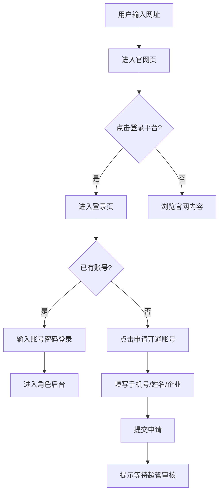
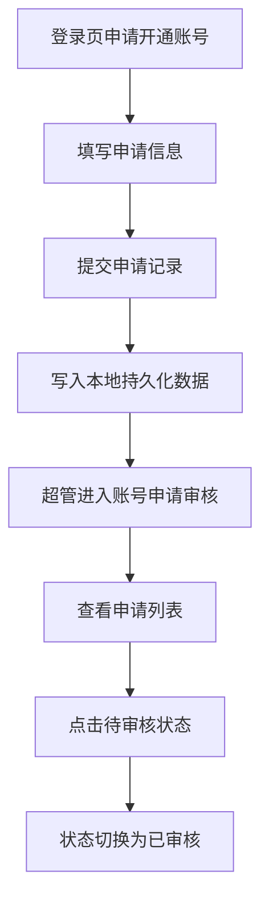
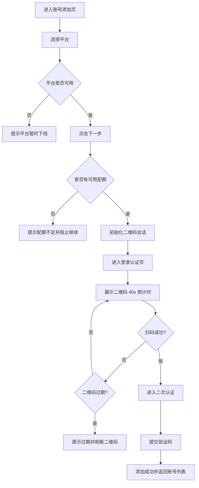
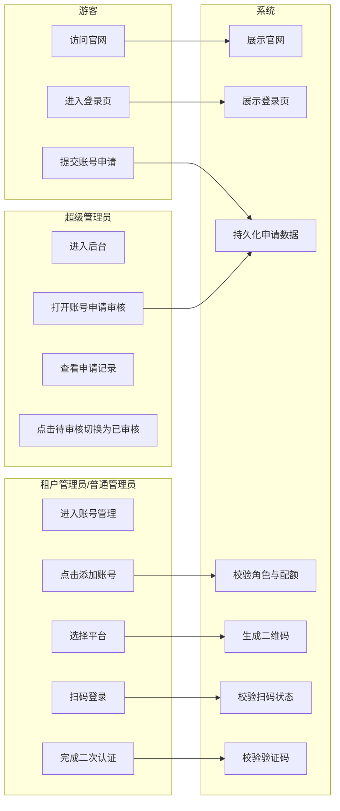

# OrbitHub 前台入口与账号接入详细版 PRD

## 1. 需求概述

### 1.1 文档信息

| 项目 | 内容 |
|---|---|
| 产品名称 | OrbitHub |
| 文档名称 | 前台入口与账号接入详细版 PRD |
| 文档版本 | V1.0 |
| 基础输入文档 | `doc/product-updates-prd.md` |
| 覆盖范围 | 官网页、登录页、账号申请与审核、添加账号流程 |

### 1.2 文档目标

本文档用于将当前 OrbitHub 在“官网访问、登录前入口、邀请制账号申请、超管审核、租户管理员/普通管理员添加账号”这条链路上的已确认能力，整理成可供产品、设计、研发、测试共同使用的详细版 PRD。

本文档重点解决以下问题：

- 用户输入网址后应先看到什么页面
- 登录前如何传达产品能力与品牌形象
- 邀请制账号体系如何承接申请和审核
- 社交账号添加如何以更真实的平台接入方式完成

### 1.3 使用场景

- 首次访问 OrbitHub 的潜在用户先进入产品官网了解能力
- 已获邀用户从官网跳转到登录页完成登录
- 未开通用户通过登录页提交账号申请
- 超级管理员在后台查看并处理申请台账
- 租户管理员和普通管理员在后台添加社交账号

### 1.4 进入路径

| 入口页面 | 入口控件 | 跳转路径 | 进入条件 |
|---|---|---|---|
| 浏览器输入域名 | 根路径访问 | `/` | 公开访问 |
| 官网页 | `登录平台` | `/login` | 公开访问 |
| 登录页 | 登录按钮 | 角色默认后台页 | 已有账号并登录成功 |
| 登录页 | `申请开通账号` | 申请弹窗 | 邀请制未开通用户 |
| 超管后台 | `账号申请审核` 菜单 | `/management/account-request-review` | 当前角色为超级管理员 |
| 账号管理页 | `+ 添加账号` | `/account/add` | 当前角色为租户管理员或普通管理员 |

### 1.5 需求目标

- 将根路径改造成官网落地页，补齐登录前产品形象
- 优化登录页表达，使其与 OrbitHub 的企业级定位一致
- 为邀请制账号体系补齐申请入口与审核台账
- 将添加账号流程改为更清晰的“选择平台 -> 登录认证”接入方式

### 1.6 本期范围

本期范围包含：

- 官网页新增
- 登录页样式与账号申请入口
- 超管审核菜单与审核列表
- 添加账号两步流程及二维码规则

本期不包含：

- 官网二级详情页
- 价格体系、客户案例、销售咨询表单
- 真实后端审批流
- 真正的第三方平台登录集成
- 小红书恢复上线流程

## 2. 名词解释

| 名词 | 解释 |
|---|---|
| 官网页 | 用户访问根路径 `/` 后看到的公开产品展示页 |
| 登录页 | 独立登录页面 `/login`，承接登录与账号申请 |
| 邀请制 | 用户不能自行注册，必须先申请，再由超管开通 |
| 账号申请 | 用户在登录页提交的开通申请信息 |
| 审核列表 | 超管查看账号申请记录的列表页面 |
| 添加账号 | 管理员将社交平台账号接入 OrbitHub 的过程 |
| 登录认证 | 添加账号第二步，统一承载扫码登录与后续安全认证 |
| 二次认证 | 扫码成功后按平台要求继续完成的手机号验证码等认证 |

## 3. 流程图

### 3.1 前台入口总流程图



### 3.2 账号申请与审核流程图



### 3.3 添加账号流程图



### 3.4 跨角色泳道图



## 4. 角色说明

### 4.1 角色列表

| 角色 | 访问官网 | 访问登录页 | 提交申请 | 审核申请 | 添加账号 |
|---|---|---|---|---|---|
| 游客 | 可访问 | 可访问 | 可操作 | 不可操作 | 不可操作 |
| 超级管理员 | 可访问 | 可访问 | 可操作 | 可操作 | 不在本期范围 |
| 租户管理员 | 可访问 | 可访问 | 可操作 | 不可操作 | 可操作 |
| 普通管理员 | 可访问 | 可访问 | 可操作 | 不可操作 | 可操作 |

### 4.2 权限与数据范围

| 角色 | 数据范围 | 权限说明 |
|---|---|---|
| 超级管理员 | 全部申请记录 | 可查看账号申请审核菜单及列表 |
| 租户管理员 | 自己后台可管理数据 | 可进入账号添加流程 |
| 普通管理员 | 自己后台可管理数据 | 可进入账号添加流程 |

### 4.3 越权处理

| 场景 | 处理方式 |
|---|---|
| 未登录访问后台私有路由 | 跳转登录页 |
| 非超管访问审核菜单 | 菜单不显示，路由不开放 |
| 非租户/普通管理员访问添加账号页 | 不适用，原因：当前功能范围限定这两个角色 |

## 5. 功能清单

| 版本 | 模块 | 功能点 | 描述 | 优先级 |
|---|---|---|---|---|
| V1.0 | 官网 | 官网落地页 | 根路径展示公开产品官网 | P0 |
| V1.0 | 官网 | 登录入口 | 官网右上角 `登录平台` 跳转登录页 | P0 |
| V1.0 | 登录 | 登录页视觉优化 | 企业级登录页表达 | P0 |
| V1.0 | 登录 | 申请开通账号 | 登录页弹窗提交申请 | P0 |
| V1.0 | 超管后台 | 账号申请审核菜单 | 超管侧查看申请列表 | P0 |
| V1.0 | 超管后台 | 审核状态切换 | 点击待审核变为已审核 | P1 |
| V1.0 | 账号管理 | 添加账号入口 | 租户/普通管理员可点击添加账号 | P0 |
| V1.0 | 账号管理 | 平台选择 | 抖音可用，小红书禁用展示 | P0 |
| V1.0 | 账号管理 | 登录认证 | 扫码 + 二次认证统一承载 | P0 |
| V1.0 | 账号管理 | 二维码规则 | 40s 失效，手动刷新 | P0 |

### 5.1 页面控件统计汇总

| 页面/弹窗 | 控件总数 | 主要控件类型 |
|---|---:|---|
| 官网页 | 18 | 导航、按钮、能力区块、价值区块、页脚入口 |
| 登录页 | 14 | 输入框、按钮、说明区、申请入口 |
| 申请账号弹窗 | 7 | 输入框、按钮、说明文本 |
| 账号申请审核页 | 10 | 搜索框、表格列、状态文本 |
| 添加账号页-选择平台 | 8 | 步骤条、下拉、提示区、按钮 |
| 添加账号页-登录认证 | 12 | 二维码、倒计时、刷新按钮、验证码输入框、按钮 |

## 6. 详情功能设计

### 6.1 官网页

#### 6.1.1 功能概述

官网页是 OrbitHub 的公开默认落点，承担产品展示和登录前承接职能。

#### 6.1.2 前置条件

- 用户访问根路径 `/`
- 无需登录

#### 6.1.3 后置条件

- 用户了解产品核心能力
- 用户可从官网进入登录页

#### 6.1.4 页面 ASCII 线框图

```text
+--------------------------------------------------------------------------------------------------+
| OrbitHub                              产品能力  解决方案  数据价值              [登录平台]       |
|--------------------------------------------------------------------------------------------------|
| 账号矩阵驱动内容增长                                                                          |
| 统一管理账号矩阵，打通内容生成、发布分发与数据分析闭环。                                        |
|                                      [科技感视觉区 / 流程线 / 数据节点]                         |
|--------------------------------------------------------------------------------------------------|
| 核心能力：账号矩阵管理 | 内容生成 | 内容发布 | 数据分析                                        |
|--------------------------------------------------------------------------------------------------|
| 全链路流程：账号接入 -> 内容生产 -> 发布分发 -> 数据复盘 -> 策略优化                           |
|--------------------------------------------------------------------------------------------------|
| 业务价值：效率提升 | 协同统一 | 增长闭环                                                       |
|--------------------------------------------------------------------------------------------------|
| 页脚：OrbitHub / 版权所有 / 登录入口                                                           |
+--------------------------------------------------------------------------------------------------+
```

#### 6.1.5 页面与跳转关系

| 页面 | 入口 | 返回路径 | 页面内跳转 | 外部跳转 |
|---|---|---|---|---|
| 官网页 | 根路径 `/` | 无 | 页面内锚点滚动 | 点击 `登录平台` 跳转 `/login` |

#### 6.1.6 控件清单表

| 序号 | 控件名 | 控件类型 | 所属区域 | 说明 |
|---:|---|---|---|---|
| 1 | 品牌名 | 文本 | 顶部导航 | 展示 OrbitHub |
| 2 | 产品能力 | 导航项 | 顶部导航 | 定位到能力区块 |
| 3 | 解决方案 | 导航项 | 顶部导航 | 定位到流程/价值区块 |
| 4 | 数据价值 | 导航项 | 顶部导航 | 定位到价值区块 |
| 5 | 登录平台 | 按钮 | 顶部导航 | 跳转登录页 |
| 6 | Hero 主标题 | 文本 | Hero 区 | 表达产品主张 |
| 7 | Hero 副标题 | 文本 | Hero 区 | 表达平台能力闭环 |
| 8 | Hero 视觉区 | 展示区 | Hero 区 | 科技感抽象视觉 |
| 9 | 核心能力卡片 | 信息卡片 | 能力区 | 展示四大能力 |
| 10 | 全链路流程图 | 流程展示 | 流程区 | 展示产品业务链路 |
| 11 | 业务价值块 | 信息块 | 价值区 | 展示效率/协同/增长 |
| 12 | 页脚登录入口 | 文本链接 | 页脚 | 可跳转登录页 |

#### 6.1.7 控件绑定业务规则表

| 规则 | 绑定控件 | 触发条件 | 处理逻辑 | 反馈 |
|---|---|---|---|---|
| 根路径默认进入官网 | 页面容器 | 访问 `/` | 展示公开官网页 | 页面正常渲染 |
| 登录按钮跳转登录页 | `登录平台` | 点击按钮 | 跳转 `/login` | 进入登录页 |
| 已登录用户访问根路径 | 页面容器 | 已有 token 访问 `/` | 仍先展示官网 | 不自动跳后台 |

### 6.2 登录页

#### 6.2.1 功能概述

登录页用于承接已有账号用户的登录，同时为未开通用户提供申请入口。

#### 6.2.2 前置条件

- 用户进入 `/login`

#### 6.2.3 后置条件

- 登录成功进入角色默认后台页
- 未开通用户可提交账号申请

#### 6.2.4 页面 ASCII 线框图

```text
+------------------------------------------------------------------------------------+
| 左侧：账号矩阵管理 / 内容生成 / 内容发布 / 数据分析 业务表达                        |
|------------------------------------------------------------------------------------|
|                                    登录表单                                         |
| 手机号     [________________]                                                     |
| 密码       [________________]                                                     |
|                           [登录]                                                   |
|                           [申请开通账号]                                           |
|------------------------------------------------------------------------------------|
| 演示环境快捷角色入口（仅演示环境显示，生产环境不展示）                             |
+------------------------------------------------------------------------------------+
```

#### 6.2.5 控件清单表

| 序号 | 控件名 | 控件类型 | 所属区域 | 说明 |
|---:|---|---|---|---|
| 1 | 左侧能力说明 | 文本区 | 左侧视觉区 | 展示平台能力 |
| 2 | 手机号输入框 | 输入框 | 登录表单 | 登录手机号 |
| 3 | 密码输入框 | 密码框 | 登录表单 | 登录密码 |
| 4 | 登录按钮 | 按钮 | 登录表单 | 提交登录 |
| 5 | 申请开通账号 | 按钮/链接 | 登录表单 | 打开申请弹窗 |
| 6 | 演示角色入口 | 按钮组 | 页面底部/辅助区 | 仅演示环境使用的快捷登录入口，生产环境不展示 |

#### 6.2.6 字段规格表

| 字段 | 控件类型 | 是否必填 | 默认值 | 长度/格式 | 校验时机 | 错误提示 |
|---|---|---|---|---|---|---|
| 手机号 | 输入框 | 必填 | 空 | 必须为 11 位手机号 | 提交时 | `请输入正确的手机号` |
| 登录密码 | 密码框 | 必填 | 空 | 1-50 字 | 提交时 | `请输入密码` |

#### 6.2.7 按钮规格表

| 按钮 | 点击行为 | 成功反馈 | 失败反馈 | 禁用/隐藏条件 | 权限控制 |
|---|---|---|---|---|---|
| 登录 | 校验表单并提交登录 | 进入角色后台 | 提示登录失败原因 | 提交中防重复 | 公开可用 |
| 申请开通账号 | 打开申请弹窗 | 弹窗打开 | 无 | 始终可用 | 公开可用 |

#### 6.2.8 异常与分支流程

| 场景 | 处理方式 |
|---|---|
| 手机号为空 | 提示 `请输入正确的手机号`，停留当前页 |
| 手机号格式错误 | 提示 `请输入正确的手机号`，停留当前页 |
| 密码为空 | 提示 `请输入密码`，停留当前页 |
| 登录失败 | 提示失败原因，不清空用户已输入手机号 |
| 演示环境 | 展示快捷角色入口，仅用于演示登录 |
| 生产环境 | 不展示快捷角色入口 |

### 6.3 申请开通账号弹窗

#### 6.3.1 功能概述

弹窗用于邀请制账号体系下的用户提交开通申请。

#### 6.3.2 页面 ASCII 线框图

```text
+--------------------------------------------------+
| 申请开通账号                                   X |
|--------------------------------------------------|
| 手机号 [____________________] *                 |
| 姓名   [____________________] *                 |
| 企业   [____________________]                   |
|--------------------------------------------------|
|                    [取消] [提交申请]             |
+--------------------------------------------------+
```

#### 6.3.3 弹窗字段表

| 字段 | 控件类型 | 是否必填 | 默认值 | 校验规则 | 错误提示 |
|---|---|---|---|---|---|
| 手机号 | 输入框 | 必填 | 空 | 必须为 11 位手机号 | `请输入正确的手机号` |
| 姓名 | 输入框 | 必填 | 空 | 1-20 字 | `请输入姓名` |
| 企业 | 输入框 | 选填 | 空 | 0-50 字 | 不适用 |

#### 6.3.4 按钮规格表

| 按钮 | 点击行为 | 成功反馈 | 失败反馈 | 禁用/隐藏条件 | 权限控制 |
|---|---|---|---|---|---|
| 提交申请 | 校验并提交申请 | 提示 `申请已提交，超管审核通过后会为您开通账号` | 提示具体错误原因 | 提交中防重复 | 公开可用 |
| 取消 | 关闭弹窗不保存 | 无 | 无 | 始终可用 | 公开可用 |
| 关闭[X] | 等同取消 | 无 | 无 | 始终可用 | 公开可用 |

#### 6.3.5 唯一性与状态规则表

| 规则类型 | 规则内容 | 失败提示 |
|---|---|---|
| 唯一性规则 | 同一手机号在 `待审核` 状态下不可重复提交申请 | `该手机号已提交申请，请等待审核` |
| 唯一性规则 | 同一手机号在 `已审核` 状态下不可再次提交申请 | `该手机号已开通或已审核，无需重复申请` |
| 初始状态 | 新提交申请记录默认状态为 `待审核` | 不适用 |
| 状态流转 | 超管点击 `待审核` 后切换为 `已审核` | 不适用 |
| 本期限制 | 当前版本不支持驳回、撤回、重新申请 | 不适用 |

#### 6.3.6 异常与分支流程

| 场景 | 处理方式 |
|---|---|
| 手机号重复申请且状态为待审核 | 拦截提交并提示 `该手机号已提交申请，请等待审核` |
| 手机号重复申请且状态为已审核 | 拦截提交并提示 `该手机号已开通或已审核，无需重复申请` |
| 提交失败 | 保留当前输入内容并提示错误 |
| 用户取消/关闭弹窗 | 关闭弹窗，不保存当前输入 |

### 6.4 账号申请审核页

#### 6.4.1 功能概述

账号申请审核页用于超级管理员查看邀请制申请记录，并完成当前版本的基础状态更新。

#### 6.4.2 前置条件

- 当前用户为超级管理员
- 进入 `账号申请审核` 菜单

#### 6.4.3 后置条件

- 可查看申请台账
- 可将 `待审核` 状态切换为 `已审核`

#### 6.4.4 页面 ASCII 线框图

```text
+-----------------------------------------------------------------------------------+
| 账号申请审核                                                                      |
| [关键字搜索____________________] [搜索]                                           |
|-----------------------------------------------------------------------------------|
| 姓名 | 手机号 | 企业 | 申请时间 | 状态                                            |
| 张三 | 138****0000 | 某企业 | 2026-07-08 10:00:00 | [待审核]                     |
| 李四 | 139****0000 | -      | 2026-07-08 09:00:00 | 已审核                        |
+-----------------------------------------------------------------------------------+
```

#### 6.4.5 控件清单表

| 序号 | 控件名 | 控件类型 | 所属区域 | 说明 |
|---:|---|---|---|---|
| 1 | 页面标题 | 文本 | 页头 | 显示 `账号申请审核` |
| 2 | 关键字搜索框 | 输入框 | 搜索区 | 支持姓名/手机号/企业检索 |
| 3 | 搜索按钮 | 按钮 | 搜索区 | 触发列表过滤 |
| 4 | 申请人姓名列 | 表格列 | 列表 | 展示姓名 |
| 5 | 手机号列 | 表格列 | 列表 | 展示手机号 |
| 6 | 企业列 | 表格列 | 列表 | 展示企业，未填显示 `-` |
| 7 | 申请时间列 | 表格列 | 列表 | 展示申请时间 |
| 8 | 状态列 | 状态列 | 列表 | 展示 `待审核` / `已审核` |

#### 6.4.6 状态枚举表

| 状态 | 枚举值 | 绑定控件 | 操作可用性 | 进入条件 | 退出条件 |
|---|---|---|---|---|---|
| 待审核 | `PENDING` | 状态列 | 可点击 | 新申请提交成功 | 点击状态切换为已审核 |
| 已审核 | `REVIEWED` | 状态列 | 不可再次切换 | 从待审核点击而来 | 不适用 |

#### 6.4.7 控件绑定业务规则表

| 规则 | 绑定控件 | 触发条件 | 处理逻辑 | 反馈 |
|---|---|---|---|---|
| 搜索过滤 | 搜索框、搜索按钮 | 输入关键字并搜索 | 匹配姓名/手机号/企业 | 列表过滤结果更新 |
| 最新优先 | 列表 | 页面加载 | 按申请时间倒序展示 | 最新申请在前 |
| 状态切换 | 状态列 | 点击 `待审核` | 记录状态改为 `已审核` | 列表即时更新 |

#### 6.4.8 页面状态与异常表现

| 场景 | 页面表现 |
|---|---|
| 正常有数据 | 正常展示列表 |
| 无申请记录 | 展示空态，提示当前暂无申请记录 |
| 搜索无结果 | 展示空态，提示未搜索到匹配申请记录 |
| 加载失败 | 展示错误提示，允许用户重新搜索或刷新页面 |

### 6.5 添加账号页

#### 6.5.1 功能概述

添加账号页用于租户管理员与普通管理员将社交平台账号接入 OrbitHub。

#### 6.5.2 前置条件

- 当前用户为租户管理员或普通管理员
- 从账号管理页进入添加账号页

#### 6.5.3 后置条件

- 账号成功接入并返回账号列表
- 若配额不足，则阻止继续接入

#### 6.5.4 页面与跳转关系

| 页面 | 入口 | 返回路径 | 页面内跳转 | 外部跳转 |
|---|---|---|---|---|
| 选择平台 | 账号管理页 `+ 添加账号` | 取消返回账号列表 | 点击下一步进入登录认证 | 无 |
| 登录认证 | 选择平台页 | 返回上一步回到选择平台 | 扫码、确认进入后续认证、二次认证表单展示 | 成功后返回账号列表 |

#### 6.5.5 Step 1 选择平台 ASCII 线框图

```text
+--------------------------------------------------------------+
| 步骤：选择平台 -> 登录认证                                   |
|--------------------------------------------------------------|
| 标题：选择平台                                               |
| 说明：先选择平台，再按平台要求完成登录认证                   |
| 提示区：平台状态 / 配额说明                                  |
| 平台 [抖音 v]                                                |
| 小红书（因封控原因暂时下线，不可选）                         |
|--------------------------------------------------------------|
|                                      [取消] [下一步]          |
+--------------------------------------------------------------+
```

#### 6.5.6 Step 2 登录认证 ASCII 线框图

```text
+--------------------------------------------------------------+
| 步骤：选择平台 -> 登录认证                                   |
|--------------------------------------------------------------|
| 标题：登录认证                                               |
| 说明：请先使用手机扫码登录；扫码成功后确认进入后续认证        |
| 提示区：扫码说明 / 已扫码成功提示 / 手机号提示                |
|                         [二维码]                              |
|                     [刷新二维码]                              |
|                二维码有效剩余 00:40                          |
|--------------------------------------------------------------|
| 扫码成功后：                                                  |
| [确认进入后续认证]                                            |
| 绑定手机号：138****8000                                       |
| 验证码 [______________]                                      |
|--------------------------------------------------------------|
|                       [返回上一步] [取消] [完成认证]          |
+--------------------------------------------------------------+
```

#### 6.5.7 控件清单表

| 序号 | 控件名 | 控件类型 | 所属区域 | 说明 |
|---:|---|---|---|---|
| 1 | 步骤条 | 步骤组件 | 页面顶部 | 两步流程指示 |
| 2 | 平台下拉 | 下拉框 | Step1 | 选择平台 |
| 3 | 平台提示区 | 提示区 | Step1 | 展示平台可用性和配额说明 |
| 4 | 下一步 | 按钮 | Step1 | 初始化二维码会话 |
| 5 | 二维码区域 | 展示区 | Step2 | 展示登录二维码 |
| 6 | 刷新二维码 | 按钮 | Step2 | 刷新二维码 |
| 7 | 倒计时 | 文本 | Step2 | 展示剩余有效期 |
| 8 | 扫码提示 | 文本 | Step2 | 展示扫码引导 |
| 9 | 确认进入后续认证 | 按钮 | Step2 待确认区 | 扫码成功后手动进入后续认证 |
| 10 | 验证码输入框 | 输入框 | Step2 二次认证区 | 输入短信验证码 |
| 11 | 完成认证 | 按钮 | Step2 | 提交验证码 |
| 12 | 返回上一步 | 按钮 | Step2 | 返回平台选择并清空上下文 |
| 13 | 取消 | 按钮 | Step2 | 返回账号列表 |

#### 6.5.8 下拉/枚举数据源表

| 控件 | 选项 | 默认值 | 空选项 | 联动规则 | 编辑回显 |
|---|---|---|---|---|---|
| 平台下拉 | 抖音、小红书 | 空 | 有 `请选择平台` | 选择禁用平台时不可继续 | 重新登录模式回显目标平台并锁定 |

#### 6.5.9 状态枚举表

| 状态 | 枚举值 | 绑定控件 | 操作可用性 | 进入条件 | 退出条件 |
|---|---|---|---|---|---|
| 可用平台 | `enabled` | 平台下拉 | 可选 | 平台当前可接入 | 不适用 |
| 禁用平台 | `disabled` | 平台下拉 | 不可选 | 平台暂时下线 | 平台恢复上线 |
| 等待扫码 | `WAITING_SCAN` | 二维码区 | 可刷新 | 初始化二维码成功 | 扫码成功或过期 |
| 已扫码待确认 | `PENDING_CONFIRM` | 确认进入后续认证按钮 | 可确认继续 | 扫码成功且存在后续流程 | 点击确认进入认证或直接完成 |
| 二次认证中 | `NEED_AUTH` | 验证码输入区 | 可提交 | 用户点击确认进入后续认证且平台要求认证 | 提交成功 |
| 认证成功 | `SUCCESS` | 页面状态 | 不可继续操作 | 验证码校验通过或无需后续认证 | 返回账号列表 |
| 已过期 | `EXPIRED` | 二维码区 | 需刷新 | 倒计时归零 | 点击刷新获取新二维码 |

#### 6.5.10 字段规格表

| 字段 | 控件类型 | 是否必填 | 默认值 | 长度/格式 | 校验时机 | 错误提示 |
|---|---|---|---|---|---|---|
| 平台 | 下拉框 | 必填 | 空 | 仅可选择可用平台 | 点击下一步时 | `请选择平台` |
| 验证码 | 输入框 | 条件必填 | 空 | 6 位数字 | 提交认证时 | `请输入验证码` |

#### 6.5.11 按钮规格表

| 按钮 | 点击行为 | 成功反馈 | 失败反馈 | 禁用/隐藏条件 | 权限控制 |
|---|---|---|---|---|---|
| 下一步 | 校验平台和配额，初始化二维码会话 | 提示 `二维码已生成，请扫码继续` | 提示配额不足/平台不可用/生成失败 | 平台不可用或请求中禁用 | 租户管理员/普通管理员可用 |
| 刷新二维码 | 重新请求二维码 | 提示 `二维码已刷新` | 提示刷新失败 | 无 sessionId 时不可用 | 同上 |
| 确认进入后续认证 | 使用已获取的认证上下文进入后续流程 | 展示验证码输入区或直接成功 | 提示进入失败或会话失效 | 仅扫码成功后显示 | 同上 |
| 完成认证 | 提交验证码 | 提示添加成功并返回列表 | 提示验证码错误或认证失败 | 无验证码或提交中禁用 | 同上 |
| 返回上一步 | 清理二维码上下文并回到 Step1 | 返回平台选择页 | 无 | 始终可用 | 同上 |
| 取消 | 返回账号列表 | 页面跳转 | 无 | 始终可用 | 同上 |

#### 6.5.12 控件绑定业务规则表

| 规则 | 绑定控件 | 触发条件 | 处理逻辑 | 反馈 |
|---|---|---|---|---|
| 小红书禁用展示 | 平台下拉 | 打开平台选项 | 显示但禁用，不允许选择 | 展示 `因封控原因暂时下线` |
| 配额拦截 | 下一步 | 点击下一步且配额不足 | 阻止初始化二维码 | 提示配额已用尽 |
| 二维码按需生成 | 下一步 | 平台合法且配额足够 | 初始化会话并进入登录认证 | 二维码展示 |
| 二维码 40s 失效 | 倒计时、二维码区 | 倒计时归零 | 标记二维码过期 | 提示过期并要求刷新 |
| 不自动重发二维码 | 二维码区 | 二维码过期 | 不自动请求新二维码 | 用户需点击刷新 |
| 扫码成功手动确认 | 确认进入后续认证 | 轮询返回已扫码成功 | 页面停留当前步骤，等待用户确认 | 展示 `已扫码成功，请确认后继续` |
| 当前管理员重复绑定拦截 | 完成认证 | 扫码识别到账号已被当前管理员绑定 | 阻止重复入库 | 提示 `该账号已在当前账号列表中，无需重复添加` |
| 他人已绑定拦截 | 完成认证 | 扫码识别到账号已被其他管理员绑定 | 阻止接入 | 提示 `该账号已被其他管理员绑定，无法重复接入` |
| 新账号正常接入 | 完成认证 | 账号未被绑定且认证成功 | 写入当前管理员账号列表 | 提示添加成功并返回列表 |
| 返回上一步清理上下文 | 返回上一步 | 点击按钮 | 清空 sessionId、二维码、认证上下文 | 返回 Step1 |
| 重新登录平台锁定 | 平台下拉 | 重新登录模式 | 平台不可修改 | 仅展示当前平台 |
| 小红书重新登录限制 | 页面容器 | 重新登录目标平台为小红书 | 不进入扫码流程 | 提示当前平台暂不支持重新登录 |

#### 6.5.13 异常与分支流程

| 场景 | 处理方式 |
|---|---|
| 未选择平台点击下一步 | 提示 `请选择平台`，停留当前页 |
| 选择禁用平台 | 不允许继续，提示平台暂不可用 |
| 配额不足 | 允许进入页面，但点击下一步被拦截 |
| 二维码过期 | 提示 `二维码已过期，请刷新重试` |
| 刷新二维码失败 | 保留当前页并提示错误 |
| 轮询超时 | 停留当前页并提示扫码状态获取失败，可刷新二维码重试 |
| 扫码成功未确认 | 页面保持在登录认证页，等待用户点击确认进入后续认证 |
| 验证码错误 | 停留在认证区并提示 `验证码错误，请重新输入` |
| 当前管理员重复绑定 | 阻止继续并提示 `该账号已在当前账号列表中，无需重复添加` |
| 他人已绑定 | 阻止继续并提示 `该账号已被其他管理员绑定，无法重复接入` |
| 会话失效 | 提示重新扫码 |
| 认证中取消/返回 | 取消返回账号列表，返回上一步则清空上下文回到平台选择 |

## 7. 非功能性设计

### 7.1 数据需求

- 账号申请记录需在当前浏览器下持久化
- 审核列表需支持刷新后复现
- 添加账号二维码会话需支持本次页面内状态维护

### 7.2 性能需求

| 操作类型 | 性能要求 |
|---|---|
| 官网首次加载 | ≤1 秒 |
| 登录页首次加载 | ≤1 秒 |
| 申请提交 | ≤2 秒 |
| 审核列表加载 | ≤1 秒 |
| 二维码初始化 | ≤2 秒 |
| 二维码刷新 | ≤1 秒 |
| 验证码提交 | ≤2 秒 |

### 7.3 安全需求

| 场景 | 要求 |
|---|---|
| 登录 | 密码输入需遮挡显示 |
| 申请表单 | 防止脚本注入与异常字符导致页面异常 |
| 审核菜单 | 非超管不可见 |
| 添加账号 | 二维码过期后不得继续推进认证 |
| 特殊字符 | 姓名、企业、搜索关键词需安全处理 |

### 7.4 操作审计

| 场景 | 审计要求 |
|---|---|
| 申请提交 | 记录申请时间、申请人手机号、姓名、企业 |
| 审核状态切换 | 记录审核时间、状态变化 |
| 添加账号成功 | 记录账号接入动作与时间 |

### 7.5 跨页面一致性

| 检查项 | 统一口径 |
|---|---|
| 术语统一 | 使用“官网页”“登录页”“申请开通账号”“账号申请审核”“登录认证” |
| 字段规格一致 | 手机号统一按 11 位校验 |
| 操作方式统一 | 取消/关闭均不保存；提交中防重复点击 |
| 数据格式统一 | 日期统一 `YYYY-MM-DD HH:mm:ss` |
| 权限逻辑统一 | 未登录拦截后台、审核仅超管、添加账号仅租户/普通管理员 |

## 8. 验收标准

### 8.1 功能验收表

| 编号 | 场景 | 前置条件 | 操作 | 预期结果 |
|---|---|---|---|---|
| AC-001 | 根路径进入官网 | 用户访问 `/` | 打开网址 | 显示官网页，不直接进入登录页或后台 |
| AC-002 | 官网登录入口 | 官网页已展示 | 点击 `登录平台` | 进入 `/login` |
| AC-003 | 登录页保留原登录方式 | 进入登录页 | 输入手机号和密码并登录 | 正常登录进入后台 |
| AC-004 | 登录页手机号格式错误 | 进入登录页 | 输入非法手机号并提交 | 阻止提交并提示 `请输入正确的手机号` |
| AC-005 | 演示入口环境隔离 | 分别处于演示环境和生产环境 | 打开登录页 | 演示环境展示快捷角色入口，生产环境不展示 |
| AC-006 | 申请账号弹窗打开 | 进入登录页 | 点击 `申请开通账号` | 展示申请弹窗 |
| AC-007 | 申请账号必填校验 | 弹窗已打开 | 不填手机号/姓名提交 | 阻止提交并提示错误 |
| AC-008 | 申请账号成功 | 输入合法手机号、姓名、企业 | 点击提交 | 提示申请已提交 |
| AC-009 | 申请手机号重复待审核拦截 | 已存在同手机号待审核申请 | 再次提交申请 | 阻止提交并提示 `该手机号已提交申请，请等待审核` |
| AC-010 | 申请手机号重复已审核拦截 | 已存在同手机号已审核申请 | 再次提交申请 | 阻止提交并提示 `该手机号已开通或已审核，无需重复申请` |
| AC-011 | 超管可见审核菜单 | 超管登录后台 | 进入管理菜单 | 显示 `账号申请审核` |
| AC-012 | 非超管不可见审核菜单 | 非超管登录后台 | 查看管理菜单 | 不显示审核菜单 |
| AC-013 | 审核列表展示 | 超管进入审核页 | 页面加载 | 展示姓名、手机号、企业、申请时间、状态 |
| AC-014 | 审核列表搜索 | 审核页有数据 | 输入关键字搜索 | 姓名/手机号/企业均可命中 |
| AC-015 | 审核列表空态 | 当前无申请记录 | 进入审核页 | 展示空态提示 |
| AC-016 | 审核搜索无结果 | 审核页有数据 | 输入无匹配关键字搜索 | 展示无结果空态提示 |
| AC-017 | 审核列表加载失败 | 审核页加载异常 | 进入页面或搜索 | 展示失败提示并可重试 |
| AC-018 | 待审核切换已审核 | 列表存在待审核记录 | 点击状态 | 状态变为已审核 |
| AC-019 | 申请记录刷新后保留 | 已存在申请记录 | 刷新页面 | 申请记录仍可见 |
| AC-020 | 添加账号入口可点击 | 租户/普通管理员进入账号管理 | 点击 `+ 添加账号` | 进入添加账号页 |
| AC-021 | 平台选择页展示 | 进入添加账号页 | 页面加载 | 展示平台选择与步骤条 |
| AC-022 | 小红书禁用展示 | 打开平台下拉 | 查看选项 | 小红书显示为禁用并带下线说明 |
| AC-023 | 抖音可用 | 打开平台下拉 | 选择抖音 | 可正常选择并推进 |
| AC-024 | 下一步后才生成二维码 | 选择抖音 | 点击下一步 | 进入登录认证页并展示二维码 |
| AC-025 | 配额不足拦截 | 当前账号无可用配额 | 点击下一步 | 停留当前页并提示配额不足 |
| AC-026 | 二维码 40s 过期 | 进入登录认证页 | 等待倒计时结束 | 二维码过期并提示刷新 |
| AC-027 | 刷新二维码 | 二维码已过期或需重试 | 点击刷新二维码 | 获取新二维码并重新倒计时 |
| AC-028 | 扫码成功待确认 | 抖音扫码成功 | 轮询状态返回需要认证 | 页面停留当前步骤并展示确认进入后续认证按钮 |
| AC-029 | 手动确认进入后续认证 | 已扫码成功且存在后续认证 | 点击确认进入后续认证 | 展示验证码输入区 |
| AC-030 | 轮询或会话异常 | 登录认证过程中轮询超时或会话失效 | 等待状态返回 | 停留当前页并提示重试或重新扫码 |
| AC-031 | 当前管理员重复绑定拦截 | 目标社交账号已被当前管理员绑定 | 完成扫码和认证 | 阻止添加并提示账号已存在 |
| AC-032 | 他人已绑定占用拦截 | 目标社交账号已被其他管理员绑定 | 完成扫码和认证 | 阻止添加并提示账号已被占用 |
| AC-033 | 验证码错误 | 输入错误验证码 | 点击完成认证 | 提示错误并停留当前页 |
| AC-034 | 验证码正确 | 输入正确验证码 | 点击完成认证 | 添加成功并返回账号列表 |
| AC-035 | 返回上一步清空上下文 | 处于登录认证页 | 点击返回上一步 | 返回选择平台页并清空二维码会话 |

### 8.2 测试点覆盖结论

| 测试点 | 结论 |
|---|---|
| 列表正常展示 | 适用，审核列表需覆盖 |
| 空数据 | 适用，审核列表空数据需展示缺省态 |
| 分页加载 | 不适用，原因：当前审核页方案未强调分页交互细节 |
| 下拉刷新 | 不适用，原因：当前后台页未设计手势刷新 |
| 加载失败 | 适用，官网/登录/审核/添加账号均需覆盖异常提示 |
| 必填校验 | 适用，申请表单、登录表单、添加账号认证表单需覆盖 |
| 长度边界 | 适用，姓名、企业、密码字段需定义边界 |
| 格式校验 | 适用，手机号、验证码需覆盖 |
| 重复校验 | 适用，申请手机号重复提交与社交账号重复绑定均需覆盖 |
| 安全过滤 | 适用 |
| 确定/取消/关闭/返回/防重复 | 适用 |
| 状态切换 | 适用，审核状态切换与二维码状态流转需覆盖 |
| 关联影响 | 适用，审核状态、配额拦截、二维码过期影响需覆盖 |
| 网络异常/超时/服务器错误 | 适用 |
| Token 失效 | 适用 |
| 并发冲突 | 不适用，原因：当前原型场景主要为单浏览器本地持久化演示 |
| 操作中断 | 适用，申请记录本地持久化需覆盖刷新复现 |
| 长时间操作 | 不适用，原因：当前无导入导出长任务 |
| XSS/越权/文件上传安全/特殊字符 | 适用，文件上传安全不适用，原因：本期文档不含上传功能 |
| 操作审计 | 适用 |
| 预置数据 | 不适用，原因：本期无颜色型预置数据体系 |
| 权限校验 | 适用 |
| 跨页面一致性 | 适用 |
| 错误提示规范 | 适用 |
| AI 智能体交互 | 不适用，原因：本期文档范围不含 AI 对话功能 |
| 结构化 PRD 完整性 | 适用 |

### 8.3 错误提示规范

| 场景 | 提示方式 | 文案要求 |
|---|---|---|
| 登录表单为空 | 字段下红字/Toast | 明确到具体字段 |
| 登录手机号格式错误 | 字段下红字 | `请输入正确的手机号` |
| 申请手机号错误 | 字段下红字 | `请输入正确的手机号` |
| 申请重复提交-待审核 | Toast | `该手机号已提交申请，请等待审核` |
| 申请重复提交-已审核 | Toast | `该手机号已开通或已审核，无需重复申请` |
| 平台未选择 | Toast | `请选择平台` |
| 配额不足 | Toast/Alert | 明确说明个人上限与已绑定数量 |
| 二维码过期 | Alert/Toast | `二维码已过期，请刷新重试` |
| 刷新失败 | Toast | `刷新失败，请重试` |
| 已扫码待确认 | Alert/轻提示 | `已扫码成功，请确认后继续` |
| 当前管理员重复绑定 | Toast | `该账号已在当前账号列表中，无需重复添加` |
| 他人已绑定占用 | Toast | `该账号已被其他管理员绑定，无法重复接入` |
| 验证码错误 | Toast | `验证码错误，请重新输入` |

### 8.4 PRD 完整性自检

- 已覆盖 8 个标准章节
- 已覆盖官网、登录页、申请弹窗、审核页、添加账号页的结构化设计
- 已输出关键页面 ASCII 线框图
- 已输出控件清单、字段规格、按钮规格、状态表、规则表
- 已对不适用测试点标明原因
