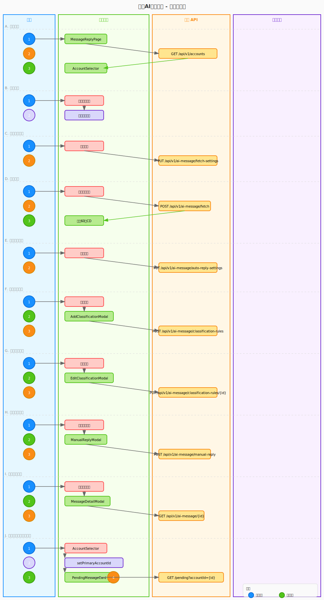

# 页面约定

## Figma 链接

- [私信 AI 自动回复-待回复评论](https://www.figma.com/design/h0gT5MlFnxNOmOIQVd1thT/%E5%A4%9A%E8%B4%A6%E5%8F%B7%E7%9F%A9%E9%98%B5%E5%BC%8F%E7%AE%A1%E7%90%86%E7%B3%BB%E7%BB%9F-Web%E7%AB%AF?node-id=2273-6007&m=dev)
- [私信 AI 自动回复-私信记录](https://www.figma.com/design/h0gT5MlFnxNOmOIQVd1thT/%E5%A4%9A%E8%B4%A6%E5%8F%B7%E7%9F%A9%E9%98%B5%E5%BC%8F%E7%AE%A1%E7%90%86%E7%B3%BB%E7%BB%9F-Web%E7%AB%AF?node-id=2273-6008&m=dev)
- [私信 AI 自动回复-空状态](https://www.figma.com/design/h0gT5MlFnxNOmOIQVd1thT/%E5%A4%9A%E8%B4%A6%E5%8F%B7%E7%9F%A9%E9%98%B5%E5%BC%8F%E7%AE%A1%E7%90%86%E7%B3%BB%E7%BB%9F-Web%E7%AB%AF?node-id=2273-6009&m=dev)

## 需求文件

- [需求文件](../../../../../requirements/prd/04-AI助手/AI助手.md)

## 验收文件

- [需求验收文件](./features/requirements.feature)
- [测试用例验收文件](./features/test.feature)

## 测试用例文件

- [测试用例文件](../../../../../tests/04-AI助手/04-AI助手-test-cases.md)

## OpenAPI 文件

- [统一响应体契约](../../../../../contract/openapi/common/unified-response-body-contract.yaml)
- [AI 助手模块 API](../../../../../contract/openapi/assistant/assistant-api.yaml) — 私信 AI 自动回复（`/api/v1/ai-assistant/message-reply/...`）

## CSS变量和样式常量文件

- [vars.css](../../../styles/ai-assistant/vars.css) - CSS变量定义
- [vars.ts](../../../styles/ai-assistant/vars.ts) - TypeScript常量定义

## 交互逻辑

### AI阅读

[交互逻辑](./swimlane.yaml)

> 同步生成 [交互泳道图](./swimlane.svg)

### 人类阅读

点击查看交互泳道图

