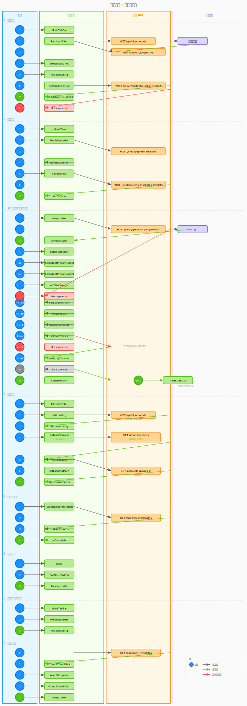

# 页面约定

## Figma 链接

### 内容发布页（content/index）

- [图文模式](https://www.figma.com/design/h0gT5MlFnxNOmOIQVd1thT/%E5%A4%9A%E8%B4%A6%E5%8F%B7%E7%9F%A9%E9%98%B5%E5%BC%8F%E7%AE%A1%E7%90%86%E7%B3%BB%E7%BB%9F-Web%E7%AB%AF?node-id=905-2310&m=dev)
- [图文模式-已上传图片](https://www.figma.com/design/h0gT5MlFnxNOmOIQVd1thT/%E5%A4%9A%E8%B4%A6%E5%8F%B7%E7%9F%A9%E9%98%B5%E5%BC%8F%E7%AE%A1%E7%90%86%E7%B3%BB%E7%BB%9F-Web%E7%AB%AF?node-id=1077-2416&m=dev)
- [视频模式](https://www.figma.com/design/h0gT5MlFnxNOmOIQVd1thT/%E5%A4%9A%E8%B4%A6%E5%8F%B7%E7%9F%A9%E9%98%B5%E5%BC%8F%E7%AE%A1%E7%90%86%E7%B3%BB%E7%BB%9F-Web%E7%AB%AF?node-id=905-2311&m=dev)
- [视频模式-已上传视频](https://www.figma.com/design/h0gT5MlFnxNOmOIQVd1thT/%E5%A4%9A%E8%B4%A6%E5%8F%B7%E7%9F%A9%E9%98%B5%E5%BC%8F%E7%AE%A1%E7%90%86%E7%B3%BB%E7%BB%9F-Web%E7%AB%AF?node-id=1082-2546&m=dev)
- [后台任务进行中](https://www.figma.com/design/h0gT5MlFnxNOmOIQVd1thT/%E5%A4%9A%E8%B4%A6%E5%8F%B7%E7%9F%A9%E9%98%B5%E5%BC%8F%E7%AE%A1%E7%90%86%E7%B3%BB%E7%BB%9F-Web%E7%AB%AF?node-id=905-2312&m=dev)
- [发布进度弹窗](https://www.figma.com/design/h0gT5MlFnxNOmOIQVd1thT/%E5%A4%9A%E8%B4%A6%E5%8F%B7%E7%9F%A9%E9%98%B5%E5%BC%8F%E7%AE%A1%E7%90%86%E7%B3%BB%E7%BB%9F-Web%E7%AB%AF?node-id=771-1799&m=dev)
- [发布结果弹窗](https://www.figma.com/design/h0gT5MlFnxNOmOIQVd1thT/%E5%A4%9A%E8%B4%A6%E5%8F%B7%E7%9F%A9%E9%98%B5%E5%BC%8F%E7%AE%A1%E7%90%86%E7%B3%BB%E7%BB%9F-Web%E7%AB%AF?node-id=778-1854&m=dev)
- [发布失败弹窗](https://www.figma.com/design/h0gT5MlFnxNOmOIQVd1thT/%E5%A4%9A%E8%B4%A6%E5%8F%B7%E7%9F%A9%E9%98%B5%E5%BC%8F%E7%AE%A1%E7%90%86%E7%B3%BB%E7%BB%9F-Web%E7%AB%AF?node-id=812-2360&m=dev)
- [内容预览与编辑](https://www.figma.com/design/h0gT5MlFnxNOmOIQVd1thT/%E5%A4%9A%E8%B4%A6%E5%8F%B7%E7%9F%A9%E9%98%B5%E5%BC%8F%E7%AE%A1%E7%90%86%E7%B3%BB%E7%BB%9F-Web%E7%AB%AF?node-id=1826-2959&m=dev)

## 需求文件

- [需求文件](../../../../requirements/prd/02-内容发布/内容发布.md)

## 验收文件

- [需求验收文件](./features/requirements.feature)
- [测试用例验收文件](./features/test.feature)

## 测试用例文件

- [测试用例文件](../../../../tests/02-内容发布/内容发布-test-cases.md)

## OpenAPI 文件

- [OpenAPI 文件](../../../../contract/openapi/content/content-api.yaml)

## CSS变量和样式常量文件

- [vars.css](../../styles/content/vars.css) - CSS变量定义
- [vars.ts](../../styles/content/vars.ts) - TypeScript常量定义

## 交互逻辑

### AI阅读

[交互逻辑](./swimlane.yaml)

> 同步生成 [交互泳道图](./swimlane.svg)

<!-- AI_SKIP_START -->

### 人类阅读

点击查看交互泳道图

<!-- AI_SKIP_END -->
