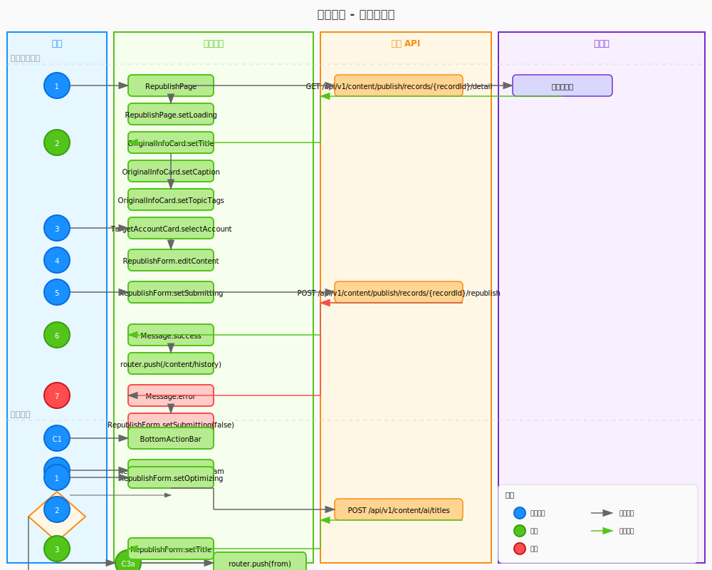

# 页面约定

## Figma 链接

- [Figma](https://www.figma.com/design/h0gT5MlFnxNOmOIQVd1thT?node-id=805-2110)

## 需求文件

- [需求文件](../../../../../requirements/prd/02-内容发布/内容发布.md)

## 验收文件

- [需求验收文件](./features/requirements.feature)
- [测试用例验收文件](./features/test.feature)

## 测试用例文件

- [测试用例文件](../../../../../tests/02-内容发布/内容发布-test-cases.md)

## OpenAPI 文件

- [OpenAPI 文件](../../../../../contract/openapi/content/content-api.yaml)

## CSS变量和样式常量文件

- [vars.css](../../../styles/content/vars.css) - CSS变量定义
- [vars.ts](../../../styles/content/vars.ts) - TypeScript常量定义

## 交互逻辑

### AI阅读

[交互逻辑](./swimlane.yaml)

> 同步生成 [交互泳道图](./swimlane.svg)

<!-- AI_SKIP_START -->

### 人类阅读

点击查看交互泳道图

<!-- AI_SKIP_END -->
