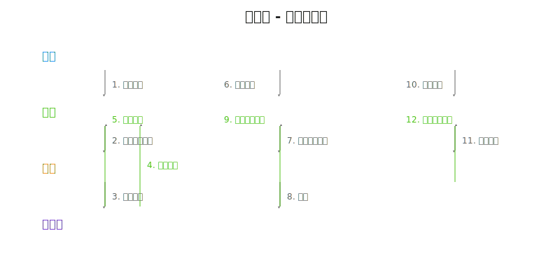

# 页面约定

## Figma 链接

- [Figma](https://www.figma.com/design/h0gT5MlFnxNOmOIQVd1thT/%E5%A4%9A%E8%B4%A5%E5%8F%B0%E5%8F%B7%E7%AE%A1%E9%98%B5%E5%8F%8F%E7%AE%A1%E7%90%86%E7%B3%BB%E7%BB%9F-Web%E7%AB%AF?node-id=3593-1676)

## 需求文件

- [需求文件](暂无)

## 验收文件

- [需求验收文件](暂无)
- [测试用例验收文件](暂无)

## 测试用例文件

- [测试用例文件](暂无)

## OpenAPI 文件

- [OpenAPI 文件](暂无)

## CSS变量和样式常量文件

- [vars.css](暂无) - CSS变量定义
- [vars.ts](暂无) - TypeScript常量定义

## 交互逻辑

### AI阅读

[交互逻辑](./swimlane.yaml)

> 同步生成 [交互泳道图](./swimlane.svg)

<!-- AI_SKIP_START -->

### 人类阅读

点击查看交互泳道图

<!-- AI_SKIP_END -->
